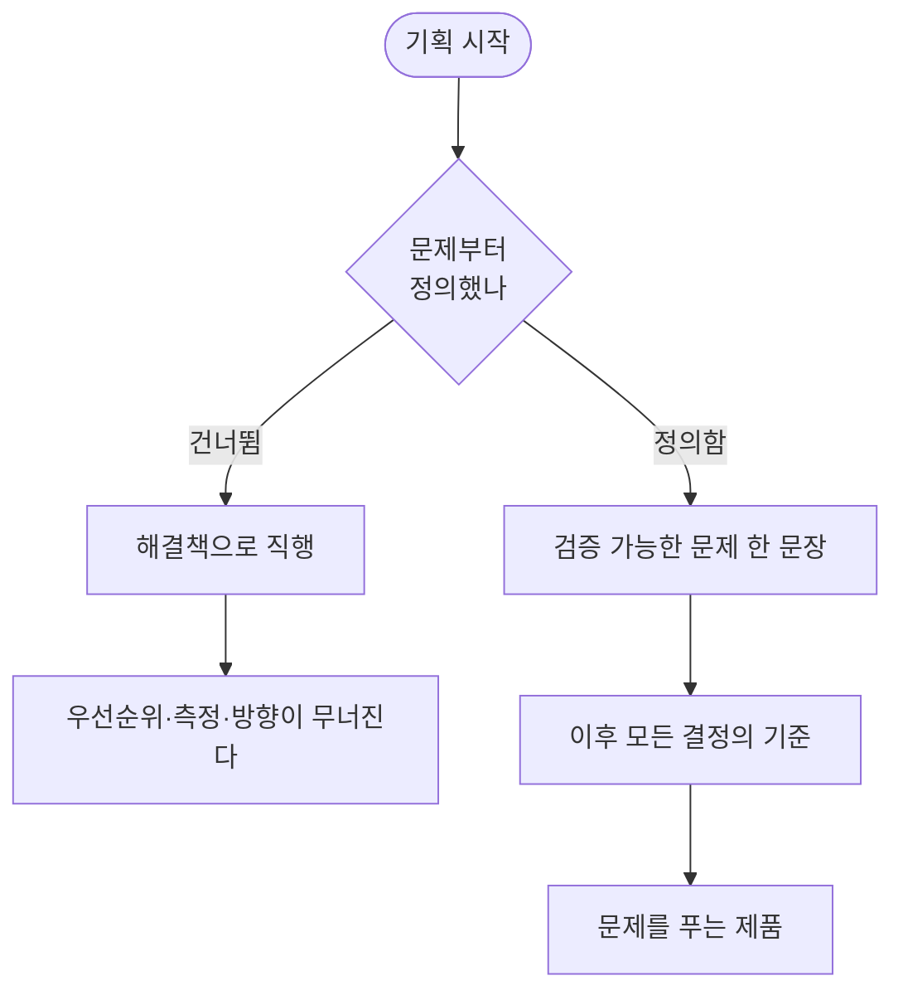

> **한 줄 요약** — 기획은 '무엇을 만들까'가 아니라 '어떤 문제를 푸는가'에서 시작한다. 문제를 검증 가능한 한 문장으로 정의해두면, 그 문장이 이후 모든 결정의 기준이 된다.
{: .prompt-tip }

## 기획은 '무엇을 만들까'에서 시작하지 않는다

기획을 시작하면 가장 먼저 "무엇을 만들까"를 떠올린다. 화면을 그리고, 기능을 적고, 일정을 잡는다. 손이 바쁘게 움직이니 일이 잘 굴러가는 듯하다.

하지만 그 질문은 이르다. 그 앞에 답할 질문이 있다.

> **"우리는 지금 어떤 문제를 풀고 있는가."**

이걸 건너뛰면, 잘 만든 기능이 아무 문제도 풀지 못한 채 출시된다. 문제정의는 기획의 첫 단계이자, 가장 오래 붙잡아야 하는 단계다.

## 문제정의를 건너뛰면 생기는 일

문제를 정의하지 않고 만들기 시작하면 세 가지가 무너진다.

- **우선순위 기준이 사라진다.** 모든 기능이 중요해 보인다. "있으면 좋은 것"과 "없으면 안 되는 것"을 가를 잣대가 없다. 결국 목소리 큰 사람 순, 만들기 쉬운 순으로 흘러간다.
- **성공을 측정할 수 없다.** 문제가 무엇이었는지 모르면 풀렸는지도 모른다. "잘 된 것 같다"는 느낌만 남고, 다음 결정에 쓸 학습은 남지 않는다.
- **팀이 같은 방향을 못 본다.** 문제가 한 문장으로 합의돼 있지 않으면 각자 다른 문제를 푼다. 디자이너도 개발자도 기획자도 각자 옳지만, 합치면 어긋난다.

막연한 걱정이 아니다. 스타트업 분석 기관 CB Insights가 실패한 기업을 조사했더니, 가장 자주 꼽힌 근본 원인은 **'시장 수요 부재(제품-시장 적합성 실패)', 약 42~43%**였다.

> 표면적 1위는 '자금 고갈'이다. 하지만 자금이 마른 이유를 거슬러 가면 결국 *아무도 절실히 원하지 않는 문제를 풀고 있었다*는 데 닿는다. 많은 실패는 실행력이 아니라 문제정의에서 이미 시작된다.
{: .prompt-warning }

기능을 빨리 만드는 건 생산성이 아니다. **틀린 문제를 빨리 푸는 건 가장 비싼 낭비다.**

## 좋은 문제정의의 조건

문제정의를 적을 때 세 가지를 점검한다.

1. **검증 가능한 문장인가.** "사용자가 불편하다"는 검증할 수 없다. 무엇이, 왜, 어떤 결과로 이어지는지가 들어가야 한다.
2. **근거 데이터가 있는가.** 직감은 출발점일 뿐이다. 통계든 설문이든, 문제가 실재한다는 증거가 있어야 한다.
3. **'문제'와 '가설'이 분리됐는가.** 문제는 관찰된 현상, 가설은 그 원인에 대한 추측이다. 섞어두면 가설이 틀렸을 때 문제까지 의심하게 된다.

## 잘하는 팀은 문제정의를 '강제'한다

중요한 줄 알아도, 막상 시작되면 누구나 해결책으로 달려간다. 그래서 잘하는 팀은 문제정의를 **강제하는 장치**를 프로세스에 심어둔다.

대표적인 예가 아마존의 **Working Backwards**다. 코드를 한 줄 짜기 전에 **출시 보도자료(PR)와 예상 질문(FAQ)를 먼저 쓴다.** 보도자료에는 고객이 겪는 문제, 기존 해결책이 실패하는 이유, 이 제품의 차별점이 설득력 있게 담겨야 한다. 문제가 와닿게 쓰이지 않으면 그 제품은 다음 단계로 못 넘어간다.

핵심은 순서다. 화면도 기능도 아닌 **'고객의 문제'가 가장 먼저 문서화되도록 일하는 방식을 설계**했다. 문제정의를 '하면 좋은 것'이 아니라 '안 하면 진도가 안 나가는 것'으로 만든 것이다.

## 문제는 절반이다 — 더블 다이아몬드

영국 디자인 카운슬이 정리한 **더블 다이아몬드(Double Diamond)**는 디자인·기획 과정을 두 개의 다이아몬드로 그린다.

_더블 다이아몬드 — 영국 디자인 카운슬, [CC BY 4.0](https://creativecommons.org/licenses/by/4.0/)_

앞 다이아몬드는 **문제**를 다룬다 — 넓게 탐색하고(Discover), 좁혀서 정의한다(Define). 뒤 다이아몬드는 **해법**을 다룬다 — 아이디어를 넓히고(Develop), 좁혀서 전달한다(Deliver).

핵심은 비율이다. 과정의 **절반**이 해법이 아니라 문제에 배정돼 있다. 그런데 우리는 보통 앞 다이아몬드를 건너뛰고 곧장 뒤로 간다. 더블 다이아몬드는 그 절반을 눈에 보이게 만들어, 문제를 건너뛰지 못하게 한다.

## 와글은 문제를 이렇게 정의했다

와글의 슬로건은 *"사이드 프로젝트를 완수하게 돕는다"*. 이 한 줄 뒤에 꽤 긴 문제정의가 있다.

### 핵심 문제 — 한 문장으로 합의하다

우리가 합의한 핵심 문제는 이렇다.

> **"사이드 프로젝트 팀들은 '책임감, 체계, 지속성'의 부족으로 인해 성공적으로 프로젝트를 완수하지 못하고, 장기 생존 확률이 현저히 낮다."**

이 문장이 중요한 건, 이후의 모든 결정이 여기로 되돌아와 검증되기 때문이다. 새 기능 아이디어마다 묻는다. "이게 책임감·체계·지속성 중 무엇을 채우나?" 답하지 못하면 지금 만들 게 아니다.

### 문제와 가설을 분리하다

핵심 문제 옆에 **핵심 가설**을 따로 적었다.

> **"사이드 프로젝트 팀들은 서비스 내 팀원 관리 기능의 부재로 인해 '책임감, 체계, 지속성'의 부족으로 이어져 서비스를 지속하기 어려웠을 것이다."**

문제(완주하지 못한다)는 관찰된 사실, 가설(팀원 관리 기능이 없어서다)은 원인에 대한 추측이다. 나눠두면 "기능을 넣었는데도 완주율이 안 오른다"는 결과가 나와도 당황하지 않는다. 문제가 틀린 게 아니라 가설이 틀린 것이고, 다음 가설을 세우면 된다.

### Pain Point를 끝까지 쪼개다

핵심 문제는 너무 크다. 손댈 수 있는 크기까지 쪼갰다.

**① 팀원 관리 기능의 부재.** 팀원 모집에서 가장 중요한 질문은 "이 사람과 함께 일해도 될까?"다. 기존 구인 서비스에는 이 질문에 답할 데이터가 쌓이지 않는다. 팀 빌딩의 리스크를 검증할 방법이 없다.

**② 참여도·책임감을 측정할 방법의 부재.** 프로젝트 경험이 평판 데이터로 축적되지 않는다. 아무리 열심히 해도 다음 구인 때 '신뢰도'로 증명되지 못하고 휘발된다.

둘은 동전의 양면이다. 한쪽엔 "남을 검증할 수 없다", 다른 쪽엔 "나를 증명할 수 없다"가 있다.

### 근거를 데이터로 세우다

이 문제가 실재한다는 걸 데이터로 확인했다.

| 근거 | 내용 |
| :-- | :-- |
| 창업 기업 생존율 | 한국 기업의 5년 차 생존율 33.8% — OECD 비교에서 낮다 |
| 오픈소스 생존 곡선 | GitHub 최상위 프로젝트도 약 50개월 뒤 생존 확률 50% 수준 (Jailton Coelho) |
| 어려움 (설문) | 프로젝트 관리 21% · 커뮤니케이션 16% · 팀 셋업 13% |
| 포기 이유 (설문) | 바쁨 29% · 비성장 25% · 혼자만 열심 21% |

상위 응답이 전부 '함께 일하는 방식'에 몰렸다. 데이터는 문제를 설득력 있게 만들고, 동시에 **범위를 좁혀준다.** 설문이 '팀'을 가리켰기에, 우리는 결제·성장이 아니라 '팀 관리'에 집중하기로 했다.

### 경쟁 서비스에서 빈자리를 확인하다

마지막으로 기존 서비스(As-Is)를 봤다. 대표적인 모집 플랫폼에는 '내 작성글', '관심글', '설정' 같은 단순 기능뿐이었다. **팀원 관리, 상호 평가, 진행 상황 공유** — 중도 이탈을 막을 장치는 거의 없었다.

경쟁 분석의 목적은 "더 잘 만들자"가 아니다. **"시장이 비워둔 자리가 어디인가"**를 확인하는 것이다. 그 빈자리가 우리 문제정의와 일치할 때 만들 이유가 분명해진다.

## 문제정의가 만든 것

이렇게 정의한 문제는 그 뒤 와글의 거의 모든 결정의 기준이 됐다.

- 메인 기능을 '모집글'이 아니라 **'팀원 관리'**에 둔 것
- 활동이 개인의 **평판 데이터로 축적**되도록 구조를 잡은 것
- MVP 화면설계서에서 '팀 상태 보기', '리뷰', '지원자 관리'를 우선순위 위쪽에 둔 것

즉흥적으로 나온 결정이 아니다. 전부 "핵심 문제로 되돌아가 검증한" 결과다. 문제정의가 단단하면 논쟁이 짧아진다. "그게 우리 문제를 푸는가?" 한 문장으로 대부분 정리되니까.

## 정리

> 문제정의는 기획서 맨 앞 한 페이지가 아니다. 프로젝트 내내 등을 받치는 척추다.
>
> - 문제를 **검증 가능한 한 문장**으로 합의하라.
> - **문제와 가설을 분리하라.** 가설이 틀려도 다시 시작할 수 있도록.
> - **데이터로 근거를 세우고, 범위를 좁혀라.**
> - 모든 기능 결정을 **핵심 문제로 되돌려 검증하라.**
{: .prompt-tip }

좋은 문제정의는 만드는 속도를 늦추는 것처럼 보인다. 하지만 실제로는 틀린 걸 만들지 않게 해, 팀 전체의 속도를 끌어올린다. 무엇을 만들지 고민하기 전에, 어떤 문제를 푸는지부터 한 문장으로 적어보자.

---

## 참고

- CB Insights, *Why Startups Fail: Top Reasons* — [cbinsights.com](https://www.cbinsights.com/research/report/startup-failure-reasons-top/)
- Design Council, *The Double Diamond* — [designcouncil.org.uk](https://www.designcouncil.org.uk/our-resources/the-double-diamond/) · [Wikipedia](https://en.wikipedia.org/wiki/Double_Diamond_(design_process_model))
- Jailton Coelho et al., GitHub 오픈소스 프로젝트의 유지보수 생존 분석 연구
- Amazon, *Working Backwards* — 보도자료(PR)·FAQ를 먼저 작성하는 제품 개발 방식
