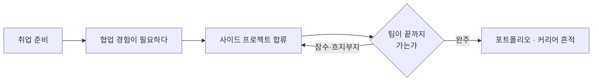

> **한 줄 요약** — '타겟'은 시장을 가리키고, '페르소나'는 한 사람을 가리킨다. 와글의 페르소나는 *완주한 협업 경험이 없어 불안한 취업준비생* 한 명이다.
{: .prompt-tip }

## '타겟'으로는 부족하다

와글의 타겟은 분명하다. **IT 사이드 프로젝트를 하고 싶은 사람, 그리고 취업준비생.**

그런데 이 문장으로는 화면 하나를 못 그린다. '취업준비생'은 수십만 명이고 저마다 사정이 다르다. 회원가입을 어디까지 간소화할지, 첫 화면에 무엇을 강조할지 — '타겟'이라는 단어는 답해주지 않는다.

그래서 한 단계 더 좁힌다. 타겟이 시장이라면, **페르소나는 그 시장 안의 구체적인 한 사람**이다. 팀이 회의에서 "사용자가…"라고 말할 때 모두의 머릿속에 같은 얼굴이 떠오르게 만드는 장치다.

## 좋은 페르소나의 조건

페르소나를 적을 때 세 가지를 지킨다.

1. **한 사람처럼 구체적으로.** '20대 취준생'이 아니라 이름·상황·말투가 있는 한 명. 추상적이면 회의에서 각자 다른 사람을 떠올린다.
2. **인구통계가 아니라 맥락·동기·불안.** 나이와 성별은 페르소나가 아니다. *왜 이걸 하려는지, 무엇이 두려운지*가 페르소나다.
3. **상상이 아니라 데이터에서.** 페르소나는 창작 캐릭터가 아니다. 설문·인터뷰·문제정의에서 끌어낸 인물이어야 한다.

## 와글의 페르소나

와글의 문제정의와 마케팅 타겟을 한 사람으로 좁히면 이렇게 된다.

| 항목 | 내용 |
| :-- | :-- |
| **이름 (가칭)** | 한지우, 26세 |
| **상황** | 인문계 졸업, IT 서비스 기획(PM) 직무로 취업 준비 중 |
| **목표** | 면접에서 자신 있게 말할 *'완주한 협업 프로젝트'* 하나 |
| **시도한 것** | 오픈채팅·HOLA로 사이드 프로젝트 팀에 합류 → 세 번 흐지부지 |
| **불안** | "이번 팀도 잠수하면?" · "내가 한 기여는 어디에도 증명이 안 된다" |
| **와글에 바라는 것** | 끝까지 가는 팀, 그리고 기여가 평판으로 남는 구조 |

지우는 게으르지 않다. 자격증도 따고 인강도 들었다. 그런데 면접에서 "협업 경험을 말해보라"는 질문에 막힌다. 공모전은 1회성이었고, 사이드 프로젝트는 시작만 세 번 했다. 한 번은 팀원이 잠수했고, 한 번은 회의만 하다 끝났고, 한 번은 혼자 떠안다 지쳤다.

지우가 원하는 건 거창하지 않다. **끝까지 가는 팀 하나, 그래서 면접에서 보여줄 결과물 하나.**

지우는 이 고리에 갇혀 있다. C에서 D로 갔다가 다시 C로 돌아오기를 반복한다. 와글이 풀어야 할 건 'E로 나가는 출구'다.

> 페르소나는 동정의 대상이 아니다. **제품이 어떤 사람의 어떤 하루를 바꿔야 하는지**를 가리키는 좌표다.
{: .prompt-info }

## 페르소나가 바꾸는 결정

지우 한 명을 또렷이 세워두면, 막연하던 결정이 구체적인 질문으로 바뀐다.

- **첫 화면** — 지우의 첫 불안은 "여기 사람들도 또 잠수하면?"이다. 그러니 첫 화면이 보여줄 건 화려한 기능이 아니라 *믿을 수 있는 팀이라는 신호*다.
- **회원가입** — 지우는 이미 여러 플랫폼에 지쳐 있다. 가입이 길면 그냥 닫는다. 최소한으로.
- **프로필** — 지우의 가장 큰 결핍은 '증명되지 않는 기여'다. 활동과 평판이 프로필에 *쌓이는 게 보여야* 한다.
- **완주 경험** — 지우에게 필요한 건 매칭이 아니라 완주다. 팀원 관리·상호 평가가 곁가지가 아니라 메인이어야 하는 이유다.

같은 결정을 '타겟'에게 물으면 답이 안 나온다. '지우'에게 물으면 답이 나온다. 페르소나의 쓸모는 거기에 있다.

## 정리

> - **타겟은 시장, 페르소나는 한 사람.** 화면을 그리려면 한 사람까지 좁혀야 한다.
> - 페르소나는 인구통계가 아니라 **맥락·동기·불안**으로 쓴다.
> - 페르소나는 상상하지 말고 **데이터에서 끌어낸다.**
> - 결정이 막히면 타겟이 아니라 **페르소나에게 물어본다.**
{: .prompt-tip }

와글의 페르소나는 결국 한 문장이다. *"완주한 협업 경험이 없어 불안한 취업준비생."* 이 한 사람이 면접장에서 자신 있게 프로젝트를 말하게 되는 것 — 그게 와글이 풀려는 문제이자, 모든 화면이 되돌아와야 할 좌표다.
