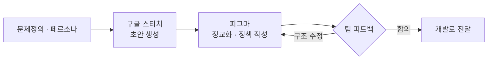

> **한 줄 요약** — 와이어프레임은 그림이 아니라 합의 도구다. 와글 32개 화면 중 가장 공들인 단계였고, 가장 많은 피드백이 오간 곳이었다. 구글 스티치로 초안 속도를 벌고, 피그마에서 정교하게 끝냈다.
{: .prompt-tip }

## 와이어프레임은 그림이 아니다

와이어프레임은 색·폰트·이미지를 걷어내고 화면의 뼈대만 그린 설계도다. 무엇이 어디에 있고, 어떤 순서로 흐르는지 — 그것만 남긴다.

와글을 만들며 내가 가장 공들인 단계가 바로 이 와이어프레임이었다. 예쁘게 만들고 싶어서가 아니다. 와이어프레임이 기획에서 가장 중요한 길목이기 때문이다.

## 왜 가장 공들였나

와이어프레임은 두 가지 의미에서 특별한 단계다.

**첫째, 추상이 처음으로 화면이 되는 곳이다.** [문제정의](/posts/problem-definition-in-planning/)와 [페르소나](/posts/waggle-persona/)는 글이다. 글은 읽는 사람마다 다른 그림을 떠올린다. 와이어프레임은 그 글을 한 장의 화면으로 못 박는다. "취준생 지우가 모집글을 본다"는 문장이, 비로소 *어떤 화면을 어떻게 보는지*가 된다.

**둘째, 마지막으로 싸게 틀릴 수 있는 곳이다.** 와이어프레임을 고치는 데는 몇 분이 든다. 개발이 끝난 화면을 고치는 데는 며칠이 든다. 틀릴 거라면 여기서 틀려야 한다.

그래서 와글 화면설계서는 가볍게 끝나지 않았다. **32개 화면, 6개 섹션**(온보딩·메인·팀·모집글·사이드바·정책)으로 갔고, 화면 한 장 한 장이 작은 기획서였다.

예를 들어 '메인 화면 — 모집글 리스트' 한 장에는 이런 게 다 들어갔다.

- 정렬 옵션(최신순/오래된순)과 탭 시 즉시 새로고침 규칙
- 직무·스킬 필터 분류 (기획·디자인·프론트·백엔드·마케팅)
- 팀명 30byte 제한, 제목 3줄 말줄임 처리
- 등록일 표기 정책 — "방금 전 / N분 전 / N시간 전 / N일 전 / YY.MM.DD"
- 검색 정책, 스킬 배지, 그리고 **Empty State**까지

와이어프레임 한 장이 곧 정책 문서였다. 박스를 그리는 일이 아니라, 그 박스가 어떻게 동작하는지를 정의하는 일이었다.

> 와이어프레임의 목적은 '예쁜 화면'이 아니다. 팀이 같은 화면을, 같은 방식으로 이해하게 만드는 것이다.
{: .prompt-info }

## 구글 스티치로 속도를 벌다

와이어프레임의 진짜 적은 '빈 화면'이다. 32개 화면을 전부 0부터 그리려면 첫 화면 앞에서 멈춰버린다.

여기서 도움을 받은 게 **구글 스티치(Google Stitch)**다. 구글 랩스의 AI UI 디자인 도구로, Gemini 2.5 모델을 기반으로 텍스트 프롬프트나 스케치를 넣으면 UI 초안을 만들어준다. 결과물은 피그마로 그대로 가져올 수 있다.

활용법은 단순했다. 화면의 의도를 프롬프트로 적으면, 스티치가 레이아웃 후보를 빠르게 뽑아준다. 덕분에 '빈 화면'이 아니라 '고칠 화면'에서 시작할 수 있었다. 0 → 1의 막막함을 AI가 덜어준 셈이다.

다만 분명히 해둘 게 있다. **AI는 속도를 줬을 뿐, 판단은 사람이 했다.** 스티치 초안을 그대로 쓰지 않았다. "이 레이아웃이 취준생 지우에게 맞나", "와글의 문제정의에 맞나"로 걸러내고, 진짜 작업은 피그마에서 정책을 붙이며 끝냈다. 초안은 빨리, 결정은 천천히.

## 가장 많은 피드백이 오간 곳

와글을 만들며 피드백이 가장 많이 오간 단계가 와이어프레임이었다. 우연이 아니다. 와이어프레임은 피드백받기에 가장 좋은 해상도이기 때문이다.

- **기획서**는 너무 추상적이다 — "좋아 보여요"에서 대화가 끝난다.
- **개발이 끝난 화면**은 너무 비싸다 — 바꾸기 아까워서 피드백이 줄어든다.
- **와이어프레임**은 그 사이다 — 구체적이라 반응할 수 있고, 싸서 바꿀 수 있다.

그래서 피드백이 여기 몰린다. 와글에서도 색이나 폰트 얘기가 아니라 *구조*에 대한 피드백이 화면마다 쌓였다. "이 버튼이 여기 있는 게 맞나", "지원하기 → 승인대기 흐름이 자연스럽나", "Empty State에서 사용자에게 뭘 보여줄까" — 전부 와이어프레임 위에서 오간 대화다.

> 피드백이 많이 오갔다는 건 문제가 아니라 신호다. 와이어프레임 단계에서 충분히 부딪치면, 개발 단계에서는 부딪칠 일이 줄어든다.
{: .prompt-warning }

## 와이어프레임이 남긴 것

와이어프레임은 결국 '합의의 기록'이다. 화면마다 팀이 함께 내린 결정이 남는다.

그 기록이 있으면, 개발자는 추측하지 않고 만들고, 디자이너는 정해진 구조 위에 옷을 입히고, QA는 그 화면설계서를 기준으로 검증한다. 한 장의 와이어프레임이 세 직군의 공통 언어가 되는 셈이다.

## 정리

> - 와이어프레임은 그림이 아니라 **합의 도구**다.
> - 가장 싸게 틀릴 수 있는 마지막 단계 — 그래서 가장 공들일 값어치가 있다.
> - **AI(구글 스티치)로 초안 속도를 벌되, 판단은 페르소나·문제정의로 한다.**
> - 피드백이 몰리는 걸 환영하라. 여기서 부딪치는 게 가장 싸다.
{: .prompt-tip }

화면을 예쁘게 그리는 일로 와이어프레임을 생각하면, 가장 지루한 단계가 된다. 하지만 '팀이 같은 그림을 보게 만드는 일'로 생각하면, 기획에서 가장 공들일 값어치가 있는 단계가 된다. 와글에서 내가 와이어프레임에 가장 오래 머문 이유다.

---

## 참고

- Google Labs, *Stitch — Design with AI* — [stitch.withgoogle.com](https://stitch.withgoogle.com/) · [소개 글](https://blog.google/innovation-and-ai/models-and-research/google-labs/stitch-ai-ui-design/)
- 관련 글 — [문제정의가 기획에서 중요한 이유](/posts/problem-definition-in-planning/) · [와글의 페르소나를 정의한다면](/posts/waggle-persona/)
