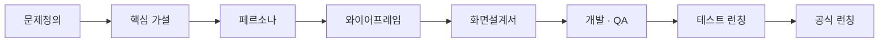

> **한 줄 요약** — 와글이 정식으로 런칭했다. 문제 한 문장에서 시작해 화면을 하나씩 쌓아 온 과정의 갈무리. 그리고 런칭이 끝이 아니라 시작인 이유.
{: .prompt-tip }

## 와글이 런칭했다

4월 16일 테스트 런칭으로 문을 살짝 열어봤고, 한 달 뒤인 5월 16일, 와글이 정식으로 세상에 나왔다. *"사이드 프로젝트를 완수하게 돕는다"*는 한 줄을 내건 서비스가, 이제 진짜 주소([waggle.lol](https://waggle.lol))를 갖게 됐다.

런칭은 늘 얼떨떨하다. 어느 날 갑자기 된 것 같지만, 돌아보면 한참 전의 한 문장에서 시작된 일이었다.

## 그간의 과정

와글은 화면보다 먼저 붙잡은 것들이 있었다. 순서가 이랬다.

- **문제정의** — "사이드 프로젝트 팀은 책임감·체계·지속성의 부족으로 완주하지 못한다"는 한 문장에서 시작했다.
- **핵심 가설** — 그 원인을 "팀원 관리 기능의 부재"로 따로 적었다. 문제와 가설을 분리해 뒀다.
- **페르소나** — 막연한 타겟을 *완주 경험이 없어 불안한 취업준비생* 한 명으로 좁혔다.
- **와이어프레임 → 화면설계서** — 그 한 명이 볼 화면을 뼈대로 그리고, 상태·정책·마이크로카피까지 나눴다. 32개 화면, 6개 섹션.
- **개발 · QA** — 페이지당 1주일, QA 회의 네 차례. 4월 16일 테스트 런칭으로 먼저 굴려보고, 5월 16일 정식 런칭으로 이어졌다.

이 블로그에 한 편씩 적어 온 글들이, 사실 이 과정의 단계별 기록이었다. ([문제정의](/posts/problem-definition-in-planning/) · [페르소나](/posts/waggle-persona/) · [와이어프레임](/posts/about-wireframes/) · [화면설계서](/posts/screen-spec-detailing/))

## 기획에서 지키려고 했던 것

잘했다고 말하려는 게 아니다. 다만 흔들릴 때마다 돌아가려 했던 기준 몇 가지는 있었다.

- **문제를 한 문장으로.** 검증할 수 있는 문장이어야 했다.
- **문제와 가설을 분리.** 가설이 틀려도 문제까지 버리지 않도록.
- **한 사람까지 좁히기.** '사용자'가 아니라 '지우'를 떠올리려 했다.
- **추측을 줄이기.** 화면설계서가 촘촘할수록 개발·디자인·QA가 덜 헤맸다.

물론 매번 잘 지킨 건 아니다. 급하면 건너뛰었고, 돌아보면 아쉬운 결정도 있다. 그래도 이 기준들이 있어서 길을 덜 잃었다고 생각한다.

> 기획이 잘됐는지는 지금 내가 정하는 게 아니다. 결국 유저가, 그리고 운영이 답해 줄 것이다.
{: .prompt-info }

## 런칭은 끝이 아니라 시작

솔직히, 축하만 하고 있기는 어렵다. 운영을 생각하면 걱정이 앞선다.

와글은 *데이터가 쌓여야 가치가 나오는* 서비스다. 활동과 평판이 프로필에 축적돼야 "이 사람과 일해도 될까?"에 답할 수 있다. 그런데 런칭 직후엔 그 데이터가 없다. 첫 유저에게 와글은 아직 텅 빈 평판 장부다.

그래서 진짜 숙제는 이제부터다.

- **콜드 스타트** — 평판 시스템은 유저가 어느 정도 모이고, 프로젝트가 실제로 완주돼야 의미를 갖는다. 그 임계치까지 어떻게 버틸까.
- **첫 완주 사례** — "와글에서 만난 팀으로 처음 끝까지 갔다"는 한 사례. 그게 백 마디 설명보다 강하다.
- **초기 유입** — 흩어져 있는 유저들에게, 아직 비어 있는 와글로 옮겨올 이유를 만들어야 한다.

기획이 "무엇을 만들까"의 답이었다면, 운영은 "만든 걸 어떻게 살아 있게 할까"의 답이다. 그 답은 아직 쓰는 중이고, 솔직히 어떻게 흘러갈지 잘 모르겠다.

## 마무리

여기까지가 런칭에 이르는 기록이다. 다음 글은 운영 쪽에서 이어가게 될 것 같다. 그때는 와글의 평판 장부가 지금보다 덜 비어 있기를 바란다.

---

## 참고

- 와글 — [waggle.lol](https://waggle.lol)
- 과정 기록 — [문제정의](/posts/problem-definition-in-planning/) · [페르소나](/posts/waggle-persona/) · [와이어프레임](/posts/about-wireframes/) · [화면설계서](/posts/screen-spec-detailing/)
