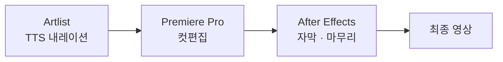

> **한 줄 요약** — Artlist TTS와 어도비 툴로 N배송 셀러 온보딩 영상을 하루 만에 만들었다. 그 과정에서 다시 확인했다 — 잘 쓴 설명서보다 잘 만든 한 편이 빠를 때가 있다. 보여주는 것도 기획이다.
{: .prompt-tip }

## 하루 만에, 아이디어에서 영상까지

서비스를 운영하다 보면 "이건 글로 설명하기 어렵네" 싶은 순간이 온다. 네이버 스마트스토어 판매자, 그 중에서도 B2B 판매자를 위한 N배송 온보딩이 그랬다.

판매자가 자기 기업 정보와 상품 정보를 직접 등록하는 과정은, 소비자가 가입하는 B2C 서비스보다 단계가 많고 복잡할 수밖에 없다. 다루는 정보가 더 많은 B2B 판매자라면 더더욱 그렇다. 글로 된 가이드만으로는 한계가 분명했다.

팀원들과 "어떻게 하면 판매자를 더 잘 온보딩시킬 수 있을까"를 고민하다가, 영상이라는 답에 닿았다. 그리고 그날 안에 만들었다. 아이디어 → 기획 → 제작이 하루 안에, 끊김 없이 굴러갔다. 예전 같으면 외주를 맡기거나 며칠은 잡았을 일이다.

## TTS는 Artlist, 편집은 어도비로

영상은 도구 하나로 끝나지 않았다. 세 도구를 이어 붙였다.

**내레이션은 Artlist의 TTS**로 만들었다. 솔직히 여기서 가장 놀랐다. '기계음 TTS'를 떠올리고 시작했는데, 막상 뽑아보니 꽤 완성도 있는 목소리가 나왔다. 어색하게 튀지 않고, 그대로 영상에 얹어도 될 수준이었다.

**컷편집은 프리미어 프로(Premiere Pro)**, **자막과 마무리는 애프터 이펙트(After Effects)**로 했다. TTS 내레이션을 깔고 → 컷을 붙이고 → 자막을 얹고 → 최종 영상으로 내보내는 순서였다.

물론 AI가 다 해준 건 아니다. AI(TTS)는 속도를 줬고, *무엇을 보여줄지*와 *어떤 순서로 보여줄지*는 사람이 정했다. 온보딩에서 판매자가 가장 헷갈리는 지점이 어디인지, 어떤 흐름으로 풀어줘야 하는지 — 그 판단이 기획이고, 도구는 그 판단을 빠르게 화면으로 옮겨줬을 뿐이다.

## 보여주는 게 기획이다

만든 영상을 팀에 공유했다. 반응이 좋았다. 그런데 내가 진짜 챙긴 건 반응이 아니라, 그때 다시 떠오른 생각이었다 — **보여주는 것도 기획이다.**

기획서는 설명한다. 화면설계서도 설명한다. 글은 읽는 사람이 머릿속에서 다시 그려야 한다. [와이어프레임](/posts/about-wireframes/)을 팀과 맞출 때 효과적이었던 이유도 결국 '글' 대신 '화면'을 보여줬기 때문이다.

영상은 거기서 한 발 더 간다. 그릴 필요 없이 그냥 보인다.

> 기획의 마지막 단계는 결국 '상대가 나와 같은 그림을 보게 만드는 것'이다. 영상은 그걸 가장 빠르게 해낸다.
{: .prompt-info }

## 온보딩도, 보여주는 게 답일 때가 있다

백문이불여일견. 유저 온보딩도 마찬가지다.

신규 유저에게 기능을 글로 설명하면, 유저는 읽고 → 이해하고 → 머릿속에서 화면을 그려야 한다. 영상은 그 세 단계를 한 번에 건너뛴다. 2~3분이면 "이 제품은 이렇게 쓰는 것"이 그냥 전달된다.

특히 **B2B에서는 더더욱** 그렇다. 네이버 스마트스토어의 B2B 판매자 온보딩이 그 예다. 판매자는 기업 정보와 상품 정보를 직접 등록해야 하고, 그 과정은 B2C 소비자 가입처럼 단순하지 않다. 게다가 보는 사람은 자기 사업을 굴리는 바쁜 판매자다. 긴 도입 가이드를 끝까지 읽을 여유가 없다. 이럴 때는 잘 만든 한 편의 영상이, 안 읽히는 열 장의 문서를 이긴다.

물론 모든 걸 영상으로 만들자는 건 아니다. 글이 빠를 때도 있다. 다만 "이건 설명이 아니라 보여줘야 한다" 싶은 지점을 알아채는 것 — 그게 운영자의 감각이라고 생각한다.

## 정리

> - 팀의 고민에서 출발해, 아이디어 → 기획 → 제작이 하루 안에.
> - Artlist TTS + 프리미어 프로 + 애프터 이펙트 — 도구를 이어 붙였다. AI TTS 완성도가 생각보다 높았다.
> - 설명이 아니라 보여주기. **보여주는 것도 기획이다.**
> - 온보딩, 특히 B2B에선 — 백문이불여일견.
{: .prompt-tip }

영상은 디자이너만의 일이 아니다. 무엇을 보여줄지 정하는 건 기획이고, 운영이다. 다음에 또 막히는 온보딩이 보이면, 다시 하루를 잡고 만들어볼 생각이다.

---

## 참고

- Artlist — *AI Video Generator* — [artlist.io](https://artlist.io/ai/video-generator)
- 관련 글 — [와이어프레임에 대해서](/posts/about-wireframes/) · [화면설계서로 구체화하기](/posts/screen-spec-detailing/)
