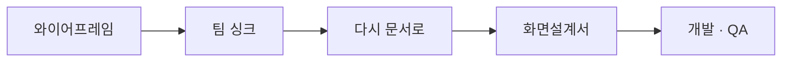
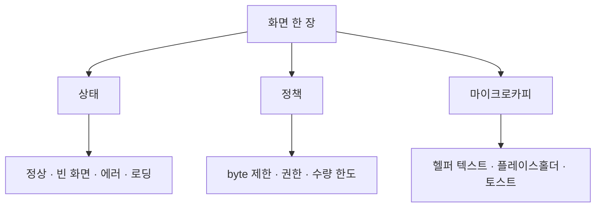

> **한 줄 요약** — 와이어프레임이 화면의 뼈대라면, 화면설계서는 그 뼈대를 상태·정책·마이크로카피로 잘게 나눈 것이다. 팀과 화면을 맞추고, 다시 문서로 돌아가 디테일을 채우는 과정이다.
{: .prompt-tip }

## 와이어프레임은 끝이 아니다

[지난 글](/posts/about-wireframes/)에서 와이어프레임은 화면의 뼈대라고 했다. 뼈대가 잡혔다고 기획이 끝난 건 아니다. 와이어프레임은 "이 화면에 무엇이 있다"까지만 말한다. "그게 어떻게 동작하느냐"는 아직 비어 있다.

그 빈칸을 채우는 게 **화면설계서**다. 와글에서는 와이어프레임을 그린 뒤, 팀과 화면을 맞추고, 다시 문서로 돌아와 화면설계서를 썼다.

## 팀원과 화면을 맞추다

와이어프레임이 좋은 이유는 *함께 볼 수 있다*는 점이다. 글로 된 기획서는 각자 다르게 읽지만, 한 장의 화면은 모두가 같은 걸 본다.

그래서 와이어프레임을 펴놓고 팀과 화면을 맞춘다. 이 자리에서 나오는 말은 대부분 질문이다.

- "이 목록이 **비어 있을 때**는 뭘 보여주지?"
- "닉네임을 **잘못 입력하면** 어떻게 알려주지?"
- "이 버튼은 **언제 눌리고 언제 막히지?**"

와이어프레임은 이 질문들에 답하지 않는다. 답해야 할 빈칸의 목록을 보여줄 뿐이다. 싱크의 결과물은 합의가 아니라, **채워야 할 빈칸의 목록**이다.

## 다시 문서로

그 빈칸을 들고 다시 문서로 돌아온다. 화면설계서는 와이어프레임 한 장을 받아, 그 화면이 가질 수 있는 모든 경우를 글로 적는 작업이다.

말하자면 화면설계서는 **와이어프레임을 잘게 나누는 일**이다. 하나의 화면, 하나의 입력칸이 상태로, 정책으로, 마이크로카피로 쪼개진다.

## 한 화면을 잘게 나눈다

와글 화면설계서에서 실제로 어떻게 쪼갰는지 세 갈래로 보자.

### 상태로 나눈다

화면은 한 가지 모습이 아니다. 데이터가 있을 때, 없을 때, 틀렸을 때가 다 다르다.

'팀 상태 관리' 화면 하나가 **준비중·진행중·완료** 세 상태로 나뉜다. 각 상태마다 카드 메시지도, 버튼도, 안내 문구도 따로 적었다. 예를 들어 '준비중'은 *"팀이 만들어졌어요. 팀원들을 모집해볼까요?"*, '완료'는 *"프로젝트가 마무리되어, 팀 활동이 종료된 상태입니다."*

특히 **빈 화면(Empty State)**은 빠뜨리기 쉽지만 가장 자주 보이는 화면이다. 지원자가 없는 팀에게는 *"지원한 동료가 아직 없어요. 우리 팀에 딱 맞는 동료를 기다리고 있어요."* 가 떠야 한다. 빈 화면을 설계하지 않으면, 사용자는 가장 막막한 순간에 텅 빈 화면을 본다.

### 정책으로 나눈다

다음은 규칙이다. 입력칸 하나에도 보이지 않는 규칙이 붙는다.

'모집글 작성' 화면의 정책만 봐도 — 제목은 최대 150byte, 모집 인원은 최대 15명, 상세 내용은 7000byte. 팀에 소속된 사람만 작성할 수 있고, 미소속이면 진입 자체가 막힌다. 상세 내용은 이미지 첨부가 안 되는데, *그 이유까지* 문서에 적었다("내 팀·메인홈에서 이미지를 보여줄 수 없어 마크다운 에디터의 효용이 낮음").

> 정책에는 결정만 적지 않는다. **왜 그렇게 정했는지**를 함께 적는다. 그래야 나중에 누가 "이거 왜 이래요?"라고 물을 때 문서가 대신 답한다.
{: .prompt-info }

### 마이크로카피로 나눈다

가장 잘게 나뉘는 건 글자다. 와글에는 헬퍼 텍스트·플레이스홀더·빈 상태·토스트만 따로 정리한 문서가 있을 정도다.

닉네임 입력칸 하나를 보자. *정상 입력*은 한 가지지만, *비정상 입력*은 여러 가지다. 그래서 헬퍼 텍스트가 네 개로 갈린다.

| 상황 | 헬퍼 텍스트 |
| :-- | :-- |
| 특수문자·자음/모음 입력 | 한글 자음/모음, 공백, 특수문자는 사용할 수 없어요. |
| 닉네임 중복 | 이미 사용중인 닉네임입니다. |
| byte 초과 | 6~15byte 이내로 입력이 가능해요. |
| 이모지 입력 | 이모지/이모티콘 사용은 불가능 해요. |

와이어프레임에서는 '닉네임 입력칸' 박스 하나였다. 화면설계서에서는 그 박스가 플레이스홀더 1개 + 헬퍼 텍스트 4개 + byte 정책으로 쪼개진다. 이게 '구체화'다.

## 디테일이 합의를 만든다

이렇게까지 잘게 나누는 이유는 단순하다. **빈칸을 남기면, 그 빈칸을 누군가 추측으로 채우기 때문이다.**

화면설계서가 비어 있으면 개발자는 빈 화면에 아무거나 띄우고, 디자이너는 에러 메시지를 임의로 정하고, QA는 무엇이 정답인지 모른 채 테스트한다. 화면설계서가 촘촘하면 그 추측이 사라진다. 세 직군이 같은 문서를 보고 같은 화면을 만든다.

화면설계서는 결국 와이어프레임을 '읽을 수 있는 명세'로 바꾼 것이다. 그리고 그 명세는 그대로 QA의 기준표가 된다.

## 정리

> - 와이어프레임은 "무엇이 있다"까지, 화면설계서는 "어떻게 동작한다"까지.
> - 팀 싱크의 결과물은 합의가 아니라 **채워야 할 빈칸의 목록**이다.
> - 한 화면을 **상태·정책·마이크로카피**로 잘게 나눈다.
> - 정책에는 결정과 함께 **이유**를 적는다.
> - 빈칸을 남기지 마라 — 남기면 누군가 추측으로 채운다.
{: .prompt-tip }

와이어프레임이 "이 화면을 만들자"는 약속이라면, 화면설계서는 "이 화면을 *이렇게* 만들자"는 약속이다. 기획이 구체화된다는 건, 결국 추측의 여지를 하나씩 지워가는 일이다.

---

## 참고

- 관련 글 — [와이어프레임에 대해서](/posts/about-wireframes/) · [문제정의가 기획에서 중요한 이유](/posts/problem-definition-in-planning/)
