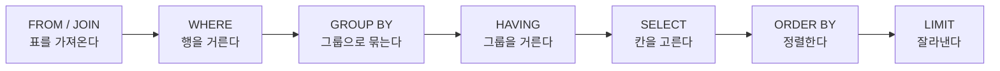

> **한 줄 요약** — SQL은 기획자·운영자가 *직접 쓰는* 유일한 개발 언어다. "지난주 가입자 몇 명?"을 데이터팀에 묻고 기다리는 대신, 스스로 5분 만에 답하기 위한 문법을 정리한다.
{: .prompt-tip }

## 왜 기획자가 SQL을 알아야 할까

기획자·운영자에게 데이터는 의사결정의 근거다. 그런데 그 데이터는 보통 개발자나 데이터팀을 거쳐야 손에 들어온다. "이 수치 좀 뽑아주세요" → 반나절, 때로는 며칠.

SQL을 알면 이 흐름이 바뀐다. 미리 만들어진 대시보드에 없는 숫자도, 직접 질문을 던져 **몇 분 만에** 꺼낼 수 있다. 빠른 판단이 필요할 때 남에게 의존하지 않아도 된다.

부수 효과도 크다. 데이터 구조를 이해하면 제품의 흐름이 더 선명하게 보이고, 더 정확한 기획서를 쓰게 되고, 데이터 분석가·개발자와 같은 언어로 대화하게 된다.

> 코드를 *쓰는* 기획자가 되라는 게 아니다. SQL만큼은 예외다 — 이건 기획자가 실제로 쓰는 언어다.
{: .prompt-info }

## SQL은 '표에게 던지는 질문'이다

문법에 들어가기 전에 그림 하나만 잡고 가자.

데이터베이스(DB)는 결국 **표(table)들의 모음**이다. 엑셀 시트 여러 장이 들어 있다고 생각하면 된다. SQL은 그 표에게 질문하는 언어다 — "이 표에서, 이런 조건의 행을, 이렇게 정리해서 보여줘."

이 글의 예시는 표 두 개로 진행한다.

**`users`** — 회원 표

| id | nickname | job | signup_date |
| :-- | :-- | :-- | :-- |
| 1 | 지우 | 기획 | 2026-05-01 |
| 2 | 민기 | 개발 | 2026-05-03 |

**`orders`** — 주문 표

| id | user_id | amount | status | created_at |
| :-- | :-- | :-- | :-- | :-- |
| 1 | 1 | 12000 | paid | 2026-05-10 09:12 |
| 2 | 1 | 8000 | cancelled | 2026-05-11 14:03 |

`orders`의 `user_id`는 `users`의 `id`를 가리킨다. 이렇게 표끼리 연결되는 칸을 기억해 두자. 나중에 JOIN에서 쓴다.

## SELECT — 무엇을 볼까

가장 기본. `SELECT`(무엇을) + `FROM`(어느 표에서).

```sql
-- users 표의 모든 칸을 본다
SELECT * FROM users;

-- 닉네임과 직무만 본다
SELECT nickname, job FROM users;
```

`*`는 "전부"라는 뜻이다. 실무에서는 필요한 칸만 콕 집어 보는 게 좋다. `AS`로 칸에 별칭을 붙일 수도 있다.

```sql
SELECT nickname AS 닉네임, signup_date AS 가입일 FROM users;
```

`--`로 시작하는 줄은 주석이다. 실행되지 않는다.

## WHERE — 조건으로 거르기

`WHERE`는 "이런 행만" 골라내는 필터다. 기획자가 가장 자주 쓰게 될 절(節)이다.

```sql
-- 직무가 '기획'인 회원만
SELECT * FROM users WHERE job = '기획';

-- 2026년 5월 이후 가입자
SELECT * FROM users WHERE signup_date >= '2026-05-01';
```

문자열은 작은따옴표(`'`)로 감싼다. 숫자는 그냥 쓴다. 비교 연산자는 `=`, `!=`(같지 않음), `>`, `<`, `>=`, `<=`.

조건을 여러 개 엮을 땐 `AND`(그리고) / `OR`(또는).

```sql
SELECT * FROM users
WHERE job = '기획' AND signup_date >= '2026-05-01';
```

자주 쓰는 조건 몇 가지.

```sql
-- IN: 여러 값 중 하나
SELECT * FROM users WHERE job IN ('기획', '디자인');

-- BETWEEN: 범위
SELECT * FROM orders WHERE amount BETWEEN 5000 AND 20000;

-- LIKE: 부분 일치 (%는 '아무 문자나')
SELECT * FROM users WHERE nickname LIKE '지%';   -- '지'로 시작
SELECT * FROM users WHERE nickname LIKE '%우%';  -- '우'를 포함
```

빈 값(NULL)을 거를 땐 주의가 필요하다.

> `WHERE job = NULL` 은 동작하지 않는다. NULL은 '값이 없음'이라 등호로 비교가 안 된다. 반드시 `IS NULL` / `IS NOT NULL`을 쓴다.
{: .prompt-warning }

```sql
SELECT * FROM users WHERE job IS NULL;       -- 직무가 비어 있는 회원
SELECT * FROM orders WHERE status IS NOT NULL;
```

## ORDER BY / LIMIT — 정렬하고 잘라내기

`ORDER BY`는 정렬. `ASC`(오름차순, 기본값) / `DESC`(내림차순).

```sql
-- 최근 가입 순
SELECT * FROM users ORDER BY signup_date DESC;
```

`LIMIT`은 상위 몇 개만 잘라낸다. "top 10" 같은 질문에 쓴다.

```sql
-- 금액이 큰 주문 5건
SELECT * FROM orders ORDER BY amount DESC LIMIT 5;
```

## 집계 함수 — 세고, 더하고, 평균내기

여기서부터가 진짜 데이터 분석이다. 행 하나하나가 아니라 *전체를 요약한 숫자*를 뽑는다.

| 함수 | 하는 일 |
| :-- | :-- |
| `COUNT()` | 개수를 센다 |
| `SUM()` | 합계 |
| `AVG()` | 평균 |
| `MIN()` / `MAX()` | 최솟값 / 최댓값 |

```sql
-- 전체 회원 수
SELECT COUNT(*) FROM users;

-- 주문 총액과 평균 주문 금액
SELECT SUM(amount), AVG(amount) FROM orders;

-- 주문한 적 있는 '서로 다른' 회원 수
SELECT COUNT(DISTINCT user_id) FROM orders;
```

`COUNT(*)`는 행 개수, `COUNT(DISTINCT 칸)`은 중복을 뺀 값의 개수다. "주문 건수"와 "주문한 사람 수"는 다르다 — 이 차이를 놓치면 숫자가 틀어진다.

## GROUP BY — 그룹으로 묶어서 집계

집계 함수는 보통 `GROUP BY`와 함께 쓴다. "전체"가 아니라 **"~별"**로 쪼개 세는 것이다.

```sql
-- 직무별 회원 수
SELECT job, COUNT(*) AS 인원
FROM users
GROUP BY job;
```

결과는 이렇게 나온다.

| job | 인원 |
| :-- | :-- |
| 기획 | 12 |
| 개발 | 9 |
| 디자인 | 7 |

"일별 가입자 추이"도 같은 원리다.

```sql
SELECT signup_date, COUNT(*) AS 가입자
FROM users
GROUP BY signup_date
ORDER BY signup_date;
```

> 규칙 하나. `SELECT`에 쓴 칸 중 집계 함수가 아닌 것은 전부 `GROUP BY`에도 있어야 한다. 위에서 `job`, `signup_date`가 양쪽에 다 있는 이유다.
{: .prompt-info }

## HAVING — 집계 결과를 거르기

"회원이 10명 넘는 직무만 보고 싶다." 이건 `WHERE`로 안 된다. `WHERE`는 *묶기 전의 행*을 거르고, 집계 결과는 *묶은 다음*에 나오기 때문이다.

묶은 다음의 결과를 거르는 건 `HAVING`이다.

```sql
SELECT job, COUNT(*) AS 인원
FROM users
GROUP BY job
HAVING COUNT(*) >= 10;
```

- **WHERE** — 묶기 *전*, 행 하나하나를 거른다.
- **HAVING** — 묶은 *후*, 집계 결과를 거른다.

## JOIN — 표 두 개를 합치기

현실의 질문은 표 하나로 안 끝난다. "주문을 많이 한 회원의 *닉네임*은?" — 주문은 `orders`에, 닉네임은 `users`에 있다. 두 표를 이어 붙여야 한다. 그게 `JOIN`이다.

연결 고리는 아까 말한 칸 — `orders.user_id` = `users.id`.

```sql
SELECT u.nickname, o.amount, o.status
FROM users AS u
JOIN orders AS o ON u.id = o.user_id;
```

`users AS u`, `orders AS o`처럼 표에 짧은 별칭을 붙이면 `u.nickname`, `o.amount`로 어느 표의 칸인지 명확해진다.

JOIN에는 종류가 있는데, 기획자는 우선 두 개만 알면 된다.

- **INNER JOIN** (그냥 `JOIN`) — 양쪽 표에 *모두 있는* 행만. 주문이 있는 회원만 나온다.
- **LEFT JOIN** — 왼쪽 표는 *전부*, 오른쪽은 있으면 붙이고 없으면 빈칸(NULL).

"가입은 했지만 주문은 한 번도 안 한 회원"을 찾을 때 LEFT JOIN이 빛난다.

```sql
SELECT u.nickname
FROM users AS u
LEFT JOIN orders AS o ON u.id = o.user_id
WHERE o.id IS NULL;   -- 붙을 주문이 없어서 빈칸인 회원
```

> JOIN하면 행 수가 늘어날 수 있다. 한 회원이 주문을 5번 했으면, 그 회원은 결과에 5줄로 나온다. 이걸 모르고 `COUNT(*)`를 세면 회원 수가 부풀려진다 — 이럴 땐 `COUNT(DISTINCT u.id)`.
{: .prompt-warning }

## 날짜 다루기

운영자는 매일 기간을 따진다. "어제", "이번 주", "지난달". 날짜 칸은 보통 이렇게 거른다.

```sql
-- 특정 하루
SELECT COUNT(*) FROM users WHERE signup_date = '2026-05-17';

-- 기간
SELECT COUNT(*) FROM orders
WHERE created_at >= '2026-05-01' AND created_at < '2026-06-01';
```

날짜·시간이 함께 든 칸(`created_at` 같은)을 '날짜 단위'로 묶고 싶을 때가 많다. 이때 쓰는 함수는 DB마다 이름이 조금 다르다.

```sql
-- 일별 주문 건수 (DB에 따라 DATE() / DATE_TRUNC() 등)
SELECT DATE(created_at) AS 날짜, COUNT(*) AS 주문수
FROM orders
GROUP BY DATE(created_at)
ORDER BY 날짜;
```

> SQL은 표준이 있지만, 날짜 함수처럼 DB 종류(MySQL·PostgreSQL·BigQuery 등)마다 미묘하게 다른 부분이 있다. 쓰는 DB가 무엇인지 먼저 확인하고, 날짜 함수는 그 DB 문서를 한 번 보고 가면 된다.
{: .prompt-info }

## CASE WHEN — 조건에 따라 값 나누기

엑셀의 `IF`와 같다. 행마다 조건을 따져 다른 값을 붙인다. **세그먼트를 나눌 때** 특히 유용하다.

```sql
SELECT
  nickname,
  CASE
    WHEN signup_date >= '2026-05-01' THEN '신규'
    ELSE '기존'
  END AS 유저구분
FROM users;
```

집계와 섞으면 더 강해진다. "신규 / 기존 유저가 각각 몇 명?"

```sql
SELECT
  CASE WHEN signup_date >= '2026-05-01' THEN '신규' ELSE '기존' END AS 구분,
  COUNT(*) AS 인원
FROM users
GROUP BY CASE WHEN signup_date >= '2026-05-01' THEN '신규' ELSE '기존' END;
```

## SQL이 실제로 실행되는 순서

코드를 '개발자처럼' 읽는 감각 하나. SQL은 **쓰는 순서와 실행되는 순서가 다르다.**

우리는 `SELECT`부터 쓰지만, DB는 `FROM`부터 처리한다.



이 순서를 알면 헷갈리던 게 풀린다 — *왜 `WHERE`에서는 `SELECT`에 붙인 별칭을 못 쓰는지*(아직 SELECT가 실행되기 전이라서), *왜 집계 필터는 `HAVING`이어야 하는지*(GROUP BY 다음이라서). 쿼리를 읽을 때도 이 순서대로 머릿속에서 따라가면 된다.

## 실전: 자주 던지는 질문 → 쿼리

문법을 질문에 붙여 보자. 기획자·운영자가 실제로 던지는 질문들이다.

**"어제 가입자 몇 명?"**

```sql
SELECT COUNT(*) FROM users WHERE signup_date = '2026-05-17';
```

**"이번 달 직무별 가입자 수는?"**

```sql
SELECT job, COUNT(*) AS 가입자
FROM users
WHERE signup_date >= '2026-05-01'
GROUP BY job
ORDER BY 가입자 DESC;
```

**"결제 완료 주문의 총매출과 평균 객단가는?"**

```sql
SELECT SUM(amount) AS 총매출, AVG(amount) AS 평균객단가
FROM orders
WHERE status = 'paid';
```

**"누적 주문액이 큰 회원 top 10은?"**

```sql
SELECT u.nickname, SUM(o.amount) AS 누적주문액
FROM users AS u
JOIN orders AS o ON u.id = o.user_id
WHERE o.status = 'paid'
GROUP BY u.nickname
ORDER BY 누적주문액 DESC
LIMIT 10;
```

**"가입했지만 한 번도 주문 안 한 회원은?"**

```sql
SELECT u.nickname, u.signup_date
FROM users AS u
LEFT JOIN orders AS o ON u.id = o.user_id
WHERE o.id IS NULL;
```

문법은 결국 이 다섯 줄짜리 질문들을 조립하는 부품일 뿐이다.

## 정리

> - SQL은 **표에게 던지는 질문**이다. `SELECT`(무엇을) · `FROM`(어디서) · `WHERE`(어떤 조건).
> - `GROUP BY` + 집계 함수로 **"~별"** 숫자를 뽑는다. 묶기 전 필터는 `WHERE`, 묶은 뒤 필터는 `HAVING`.
> - 표 두 개는 `JOIN`으로 잇는다. 행이 늘어날 수 있으니 `COUNT(DISTINCT ...)`에 주의.
> - 실행 순서는 `FROM → WHERE → GROUP BY → HAVING → SELECT → ORDER BY → LIMIT`.
> - `= NULL`은 안 된다. `IS NULL`을 쓴다.
{: .prompt-tip }

SQL은 외워서 되는 게 아니라 질문을 던지다 보면 손에 붙는다. 회사 DB에 권한이 있다면 오늘 "어제 가입자 몇 명?"부터 직접 뽑아보자. 권한이 없다면 [SQLBolt](https://sqlbolt.com/)나 [프로그래머스 SQL 고득점 Kit](https://school.programmers.co.kr/learn/challenges?tab=sql_practice_kit) 같은 연습 환경에서 시작하면 된다.

기획자가 코드를 다 알 필요는 없다. 하지만 자기 서비스의 숫자를 남에게 묻지 않고 직접 꺼내 보는 것 — 그건 분명히 일하는 방식을 바꾼다.

---

## 참고

- *SQL for Product Managers* — [HelloPM](https://hellopm.co/sql-for-product-managers-the-definitive-guide/) · [LogRocket](https://blog.logrocket.com/product-management/sql-skills-product-managers/)
- 연습 — [SQLBolt](https://sqlbolt.com/) · [프로그래머스 SQL Kit](https://school.programmers.co.kr/learn/challenges?tab=sql_practice_kit)
