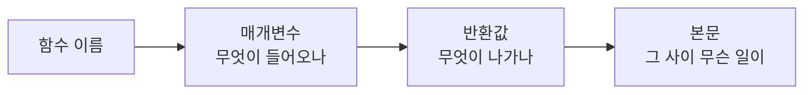

> **한 줄 요약** — 기획자·운영자도 코드를 *쓸* 필요는 없지만, 개발자가 쓴 코드를 *읽을* 줄은 알아야 한다. 빌더가 되는 첫걸음으로 정리한 자바스크립트 기초.
{: .prompt-tip }

## 빌더는 코드를 읽는다

나는 스스로를 빌더라고 부른다. 기획하고, 운영하고, 가끔은 직접 도구를 만든다. 그런데 빌더라면서 *팀이 만든 것*을 읽지도 못하면 좀 이상하지 않나.

오해는 하지 말자. 기획자가 코드를 **써야** 한다는 얘기가 아니다. 코드를 쓰는 것(coding)과 코드를 읽고 시스템을 이해하는 것(technical literacy)은 다른 능력이다. 빌더에게 필요한 건 후자다 — 깊게 짤 줄은 몰라도, **읽고 이해할 수는 있는** 정도.

읽을 수 있으면 세 가지가 달라진다.

- **소통** — 개발자와 같은 단어로 말하게 된다. 기획서의 빈틈이 줄어든다.
- **판단** — "이거 되나요?"를 덜 묻게 된다. 가능·불가능, 쉬움·어려움이 어느 정도 보인다.
- **신뢰** — PR이나 코드 변경을 대충이라도 따라갈 수 있으면, 팀에서 위치가 달라진다.

그래서 자바스크립트 기초를 *읽기 중심*으로 정리했다. 외우는 게 아니라, 코드를 만났을 때 겁먹지 않는 게 목표다.



코드를 읽을 땐 위 순서면 충분하다. 이름·입력·출력만 봐도 그 코드가 *뭘 하는지*는 대개 잡힌다.

## 변수 — 값에 이름표 붙이기

변수는 값에 이름을 붙이는 것이다. 자바스크립트에선 `let`과 `const`로 만든다.

```js
const name = "지우";   // 안 바뀌는 값
let count = 0;          // 바뀔 수 있는 값
count = count + 1;      // let이라 재할당 가능
```

읽기 포인트는 단순하다. **`const`를 보면 "이 값은 안 바뀌는구나"**, `let`을 보면 "이건 바뀌겠구나" 하고 넘어가면 된다. 옛날 코드엔 `var`도 보이는데, 요즘은 거의 `const`/`let`을 쓴다.

## 자료형 — 데이터의 종류

값에는 종류가 있다. 코드를 읽을 때 "지금 이게 무슨 타입이지?"만 알아도 절반은 읽힌다.

| 타입 | 예시 | 설명 |
| :-- | :-- | :-- |
| 문자열(string) | `"지우"`, `'기획'` | 따옴표로 감싼 글자 |
| 숫자(number) | `42`, `3.14` | 따옴표 없음 |
| 불리언(boolean) | `true`, `false` | 참/거짓 |
| null / undefined | `null` | 값이 없음 |
| 객체(object) | `{ name: "지우" }` | 이름표가 붙은 값 묶음 |
| 배열(array) | `[1, 2, 3]` | 순서가 있는 값 묶음 |

## 함수 — 일의 최소 단위

함수는 "입력을 받아 무언가를 하고 결과를 내놓는" 코드 한 덩어리다. 코드는 대부분 함수로 이루어져 있다.

```js
// 전통적인 함수 선언
function add(a, b) {
  return a + b;
}

// 화살표 함수 — 요즘 더 자주 보임
const add = (a, b) => {
  return a + b;
};
```

`add(2, 3)`처럼 부르면 `5`가 나온다. `a`, `b`는 **매개변수**(들어오는 값), `return` 뒤가 **반환값**(나가는 값)이다.

> 함수를 읽을 땐 본문부터 파고들지 마라. **이름 → 매개변수 → 반환값** 순으로 본다. `function getActiveUsers()`라는 이름과 입력·출력만 봐도, 본문을 다 안 읽어도 뭘 하는 함수인지 짐작된다.
{: .prompt-info }

## 조건문 — 갈림길

"~라면 이걸, 아니면 저걸." 코드의 갈림길이다.

```js
if (count > 10) {
  alert("10개를 넘었어요");
} else {
  alert("아직 여유 있어요");
}
```

한 줄로 줄인 **삼항 연산자**도 코드에서 정말 자주 보인다. `조건 ? 참일_때 : 거짓일_때` 구조다.

```js
const message = count > 10 ? "초과" : "정상";
```

> 코드를 읽다 `===`를 보고 당황하지 말자. `=`는 "값을 넣어라(대입)", `===`는 "두 값이 같은가(비교)"다. 완전히 다른 뜻이다.
{: .prompt-warning }

## 반복문 — 되풀이

같은 일을 여러 번. 전통적인 `for`문은 이렇게 생겼다.

```js
for (let i = 0; i < 5; i++) {
  console.log(i);   // 0, 1, 2, 3, 4
}
```

하지만 실무 코드에서 더 자주 만나는 건 배열에 붙는 `forEach`와 `map`이다.

```js
const names = ["지우", "민기", "선영"];

names.forEach(name => console.log(name));       // 하나씩 꺼내 실행
const greetings = names.map(name => name + "님"); // 새 배열을 만들어 반환
```

`forEach`는 "하나씩 돌면서 실행", `map`은 "하나씩 바꿔서 **새 배열**을 만듦". 이 둘만 알아도 반복문 읽기는 거의 끝이다.

## 객체와 배열 — 가장 자주 만지는 것

객체는 점(`.`)으로 값을 꺼낸다.

```js
const user = { name: "지우", job: "기획" };
user.name;     // "지우"
user["job"];   // "기획"
```

배열에는 자주 쓰는 메서드 세 개가 있다. 읽을 때 이 이름만 봐도 의도가 보인다.

```js
const nums = [1, 2, 3, 4, 5];

nums.map(n => n * 2);        // [2,4,6,8,10]  — 전부 변형
nums.filter(n => n > 2);     // [3,4,5]       — 조건에 맞는 것만
nums.find(n => n > 2);       // 3             — 조건에 맞는 첫 하나
```

`map`은 변형, `filter`는 골라내기, `find`는 하나 찾기. SQL의 `SELECT`·`WHERE`와 결이 비슷하다.

## 비동기 — async / await

요즘 코드의 절반은 비동기다. 서버에서 데이터를 받아오는 일은 시간이 걸리니까, "기다렸다가 받는다"는 표시가 필요하다. 그게 `async`와 `await`다.

```js
async function loadUsers() {
  const res = await fetch('/api/users');  // 서버 응답을 기다림
  const users = await res.json();         // 응답을 데이터로 변환
  return users;
}
```

읽기 포인트: **`await`를 보면 "여기서 잠깐 기다리는구나"**, `async`는 "이 함수 안엔 기다리는 일이 있구나" 정도면 충분하다. `fetch`는 서버에 요청을 보내는 명령이다.

## 실전: 코드 한 조각 읽어보기

이제 배운 걸 합쳐, 실제로 만날 법한 코드를 읽어보자.

```js
async function getActiveUsers() {
  const res = await fetch('/api/users');
  const users = await res.json();
  return users.filter(u => u.status === 'active');
}
```

한 줄씩 읽으면 이렇다.

1. `async function getActiveUsers()` — 이름이 *활성 유저 가져오기*. 매개변수는 없다. `async`니까 안에 기다리는 일이 있다.
2. `const res = await fetch('/api/users')` — `/api/users` 주소로 요청을 보내고, 응답을 기다려 `res`에 담는다.
3. `const users = await res.json()` — 응답을 실제 데이터(배열)로 바꿔 `users`에 담는다.
4. `return users.filter(u => u.status === 'active')` — 그 중 `status`가 `'active'`인 것만 골라 반환한다.

본문을 한 줄도 못 짜도 좋다. 이 함수가 *"서버에서 유저를 받아 활성 유저만 돌려준다"*는 건 이제 읽힌다. 그거면 된다.

## 정리 — 읽기의 기술

> - 빌더는 코드를 **쓰진 못해도 읽을 줄은 안다.** 읽기와 쓰기는 다른 능력이다.
> - 함수는 **이름 → 입력 → 출력** 순으로 본다. 본문은 그 다음.
> - `const`/`let`, 기본 자료형, `if`/삼항, `map`/`filter`/`find`, `async`/`await` — 이 정도면 대부분의 코드가 읽힌다.
> - `=`(대입)와 `===`(비교)를 헷갈리지 말자.
{: .prompt-tip }

기초만 잡혀도 PR 화면이 외계어가 아니게 된다. 개발자가 "이건 filter로 거른 거예요"라고 할 때 고개를 끄덕일 수 있고, 기획서를 쓸 때 무엇이 쉬운 변경이고 무엇이 큰일인지 감이 온다.

코드를 다 아는 빌더가 되자는 게 아니다. *팀이 만든 것을 읽을 수 있는* 빌더 — 거기서부터 시작하면 된다.

---

## 참고

- *Do Product Managers Need to Code?* — [Udacity](https://www.udacity.com/blog/2023/12/do-product-managers-need-to-code.html)
- *Benefits of Learning to Code for Product Managers* — [Codecademy](https://www.codecademy.com/resources/blog/benefits-learning-to-code-product-managers)
- 함께 보기 — [기획자/운영자로서 알아야 하는 SQL 문법 정리](/posts/sql-for-planners/)
