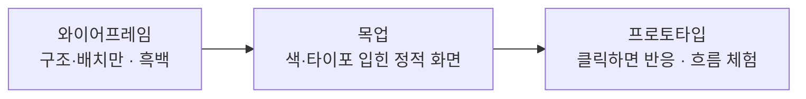

> **한 줄 요약** — 기획자가 디자인을 *직접* 할 일은 없어도, 디자이너와 같은 단어로 말해야 기획서의 빈틈이 줄어든다. 화면을 논의할 때 자주 등장하는 디자인 용어를 기획자 시점에서 정리한다.
{: .prompt-tip }

## 왜 기획자가 디자인 용어를 알아야 할까

기획자는 화면을 직접 그리지 않는다. 하지만 화면이 *어때야 하는지*는 매일 말한다 — 와이어프레임 리뷰에서, 화면설계서에서, 디자이너와의 회의에서.

이때 "여기 좀 더 눈에 띄게 해주세요" 같은 말은 해석의 폭이 너무 넓다. 같은 장면을 가리키는 정확한 단어가 있으면 피드백이 짧아지고, 결과물이 의도에 가까워진다.

용어를 외우자는 게 아니다. 회의에서 그 단어가 나왔을 때 *무슨 얘기인지 아는 것* — 거기서부터다.

## 1. 사람은 화면을 어떻게 인식하는가

### 어피던스 (Affordance)

어떤 대상이 "이렇게 쓸 수 있다"고 사용자에게 제공하는 **행동 가능성**이다. 버튼처럼 생긴 사각형은 '누를 수 있음'을, 입력칸은 '글자를 넣을 수 있음'을 암시한다.

> 기획자에게 — 새 UI 요소를 정의할 때, 사용자가 그게 *무엇을 할 수 있는 것인지* 한눈에 알 수 있는지 따져야 한다.
{: .prompt-info }

### 시그니파이어 (Signifier)

어피던스를 **알아채게 해주는 단서**다. 도널드 노먼은 '어피던스(가능성 그 자체)'와 '시그니파이어(그 가능성을 알리는 신호)'를 구분했다. 문은 원래 밀 수 있지만(어피던스), '미시오' 라벨이나 손잡이 모양이 그 사실을 알려준다(시그니파이어).

> 기획자에게 — "이게 눌리는지 모르겠다"는 문제는 대개 어피던스가 아니라 *시그니파이어의 부재*다. 기능을 더 만들 게 아니라 신호를 더 줘야 한다.
{: .prompt-info }

### 멘탈 모델 (Mental Model)

사용자가 "이건 이렇게 동작할 것"이라고 머릿속에 미리 갖고 있는 **기대**다. 장바구니는 비우기 전까지 담겨 있을 거라는 기대처럼. 제품이 이 기대와 어긋나면 사용자는 당황한다.

> 기획자에게 — 새 기능을 설계할 때 "사용자는 이걸 무엇과 비슷하다고 여길까"를 먼저 묻는다. 익숙한 모델을 따르면 학습 비용이 사라진다.
{: .prompt-info }

### 게슈탈트 원리 (Gestalt Principles)

사람이 개별 요소를 '묶어서' 인식하는 심리 법칙. 가까이 있으면 한 그룹으로(**근접**), 비슷하게 생기면 같은 종류로(**유사**), 끊긴 모양도 알아서 완성해서(**폐쇄**) 본다.

> 기획자에게 — "이 두 정보가 한 묶음으로 보여야 한다"는 요구는 결국 근접·유사의 문제다. 선을 긋기 전에 여백과 정렬로 먼저 푼다.
{: .prompt-info }

## 2. 사용성을 떠받치는 법칙

UX에는 심리학에 기반한 '경험칙'들이 있다. 디자이너가 결정의 근거로 자주 인용하므로, 기획자도 알아두면 회의가 빨라진다.

### 힉의 법칙 (Hick's Law)

선택지가 많아질수록 **결정에 걸리는 시간이 늘어난다.** 화면에 버튼·메뉴를 하나 늘릴 때마다 사용자의 결정 비용이 커진다.

> 기획자에게 — 기능을 다 보여주고 싶을 때 떠올린다. 단계를 쪼개거나(점진적 노출), 비슷한 것끼리 묶어 선택지를 줄인다.
{: .prompt-info }

### 피츠의 법칙 (Fitts's Law)

목표가 **크고 가까울수록** 누르기 쉽고 빠르다. 작은 버튼, 구석에 있는 버튼은 그만큼 누르기 어렵다.

> 기획자에게 — 자주 쓰는 핵심 버튼은 크게, 손이 닿기 좋은 위치에. 모바일에서 화면 하단·엄지 영역이 중요한 이유가 이것이다.
{: .prompt-info }

### 닐슨 휴리스틱 (Nielsen's 10 Usability Heuristics)

야콥 닐슨이 1994년에 정리한, 사용성을 점검하는 **10가지 경험칙**이다. 전수 사용성 테스트 없이도 이 10개로 화면을 훑으며 문제를 찾는 '휴리스틱 평가'에 쓰인다.

열 가지를 한 줄씩 옮기면 이렇다.

> 1. 시스템 상태의 가시성 — 지금 무슨 일이 일어나는지 보여준다
> 2. 현실 세계와의 일치 — 사용자의 말과 개념을 쓴다
> 3. 사용자 통제와 자유 — 되돌리기·빠져나갈 길을 준다
> 4. 일관성과 표준 — 같은 것은 같게, 관례를 따른다
> 5. 오류 예방 — 실수가 일어나기 전에 막는다
> 6. 회상보다 인식 — 외우게 하지 말고 보여준다
> 7. 사용의 유연성·효율 — 초보도 숙련자도 쓸 수 있게
> 8. 심미적·미니멀한 디자인 — 불필요한 정보를 덜어낸다
> 9. 오류 복구 돕기 — 무엇이 잘못됐고 어떻게 푸는지 알린다
> 10. 도움말과 문서 — 필요할 때 찾을 수 있게
{: .prompt-tip }

> 기획자에게 — 화면설계서를 다 쓴 뒤 이 10개로 셀프 체크하면 빠진 상태·예외·오류 처리가 드러난다.
{: .prompt-info }

## 3. 구조와 산출물

### 정보 구조 (IA, Information Architecture)

콘텐츠와 기능을 **어떤 위계로 묶고 나눌지**의 설계. 메뉴 구조, 화면 간 관계가 여기 해당한다.

> 기획자에게 — IA가 흔들리면 와이어프레임도 흔들린다. 화면을 그리기 전에 잡아야 하는 뼈대다.
{: .prompt-info }

### 유저 플로우 (User Flow)

사용자가 목표를 이루기까지 거치는 **화면·행동의 흐름**. 단일 화면이 아니라 '화면과 화면 사이'를 설계하는 도구다.

> 기획자에게 — 화면 하나하나를 잘 그려도 흐름이 끊기면 소용없다. 플로우는 그 연결을 검증한다.
{: .prompt-info }

### 와이어프레임 · 목업 · 프로토타입

세 가지는 따로인 게 아니라 **충실도(fidelity)가 다른 단계**다.

- **와이어프레임** — 뼈대. 무엇이 어디에 놓이는지, 구조만.
- **목업** — 살. 색·폰트·실제 비주얼이 입혀진 정적 화면.
- **프로토타입** — 움직임. 클릭하면 반응하는, 흐름을 직접 눌러볼 수 있는 버전.

> 기획자에게 — 리뷰 단계에 맞는 충실도를 요구해야 한다. 구조를 볼 단계에 색 얘기를 꺼내면 일이 꼬인다.
{: .prompt-info }

### 디자인 시스템 · 컴포넌트 · 디자인 토큰

- **디자인 시스템** — 색·타이포·컴포넌트·사용 규칙을 한 벌로 묶어 둔 것.
- **컴포넌트** — 재사용하는 UI 단위(버튼, 카드, 입력칸…).
- **디자인 토큰** — 색·간격·반경 같은 값에 이름을 붙인 것(예: 프라이머리 색 = `blue-80`).

> 기획자에게 — "새 버튼을 만들자"가 아니라 "기존 컴포넌트의 어떤 변형인가"를 먼저 묻는 습관. 시스템을 벗어난 요청은 그만큼 제작·유지 비용이 된다.
{: .prompt-info }

## 4. 화면을 정리하는 말

### 시각적 위계 (Visual Hierarchy)

무엇을 **먼저 보게 할지**의 순서. 크기·굵기·색·위치·여백으로 만든다.

> 기획자에게 — "이 화면에서 가장 중요한 한 가지"를 정하는 건 디자이너가 아니라 기획자의 몫이다. 그게 정해져야 위계가 선다.
{: .prompt-info }

### 그리드 (Grid)

화면을 일정한 열과 간격으로 나눈 **보이지 않는 격자**. 요소들이 제멋대로 놓이지 않게 잡아주는 정렬의 기준이다.

### 여백 (Whitespace)

요소 사이의 빈 공간. 비어 있는 게 아니라 **묶고 나누는 적극적인 도구**다. 게슈탈트의 근접 원리가 작동하는 곳 — 여백을 좁히면 한 그룹, 넓히면 다른 그룹으로 읽힌다.

## 정리

> - 디자인 용어는 외우는 게 아니라, 회의에서 나왔을 때 **알아듣기 위한** 것이다.
> - **인식** — 어피던스·시그니파이어·멘탈 모델·게슈탈트. 사용자가 화면을 어떻게 읽는지.
> - **법칙** — 힉(선택지)·피츠(크기·거리)·닐슨 휴리스틱(점검 체크리스트).
> - **구조·산출물** — IA·유저 플로우·와이어프레임/목업/프로토타입·디자인 시스템.
> - **정리하는 말** — 시각적 위계·그리드·여백.
{: .prompt-tip }

기획자가 디자인 용어를 쓰는 이유는 디자이너의 일을 대신하려는 게 아니다. *같은 그림을 보기 위해서*다. 정확한 단어 하나가, 두 번 그릴 화면을 한 번에 끝내준다.

---

## 참고

- 어피던스 vs 시그니파이어 — Don Norman, [jnd.org](https://jnd.org/signifiers-not-affordances/) · [Interaction Design Foundation](https://www.interaction-design.org/literature/topics/affordances)
- 사용성 휴리스틱 10가지 — [Nielsen Norman Group](https://www.nngroup.com/articles/ten-usability-heuristics/)
- 힉·피츠 등 UX 법칙 — [Laws of UX](https://lawsofux.com/)
- 함께 보기 — [와이어프레임에 대해서](/posts/about-wireframes/) · [화면설계서로 구체화하기](/posts/screen-spec-detailing/)
