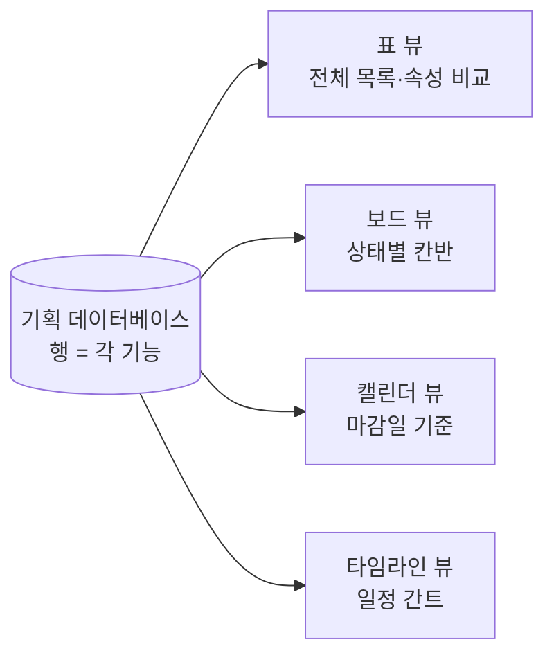
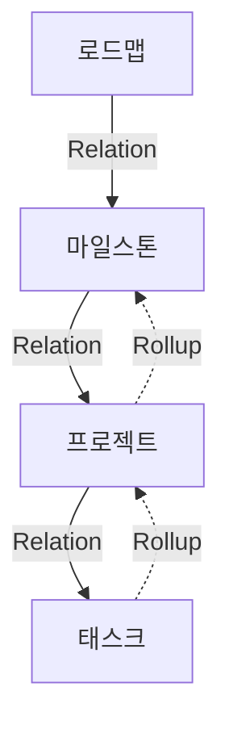
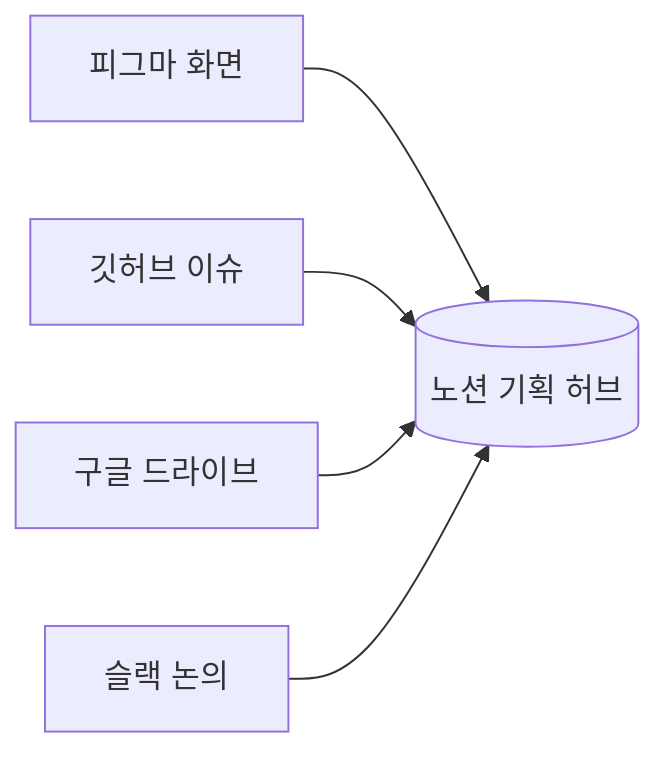

> **한 줄 요약** — 기획 문서가 워드, 엑셀, 슬랙, 피그마에 흩어져 있으면 정작 일보다 "그게 어디 있더라"를 찾는 데 시간을 더 쓰게 된다. 노션은 이 흩어진 것들을 한곳에 모으고, 데이터베이스로 서로 엮어준다. 기획자에게 노션이 중요한 건 그래서다.
{: .prompt-tip }

## 문서가 여기저기 흩어진다

기획자가 하루에 만지는 걸 떠올려 보자. PRD, 화면설계서, 회의록, 일정표, 이슈 목록, 유저 인터뷰 노트, 경쟁사 리서치, 의사결정 기록.

이게 다 다른 곳에 있다. PRD는 워드에, 일정은 엑셀에, 논의는 슬랙에, 화면은 피그마에, 할 일은 또 다른 툴에 있다. 며칠만 지나도 "그 결정 어디서 했지", "최신 버전이 이게 맞나" 확인하느라 시간이 샌다.

기획자의 시간을 잡아먹는 건 일의 양보다 이 흩어짐일 때가 많다. 노션은 흩어진 걸 한곳에 모으고, 모은 것들을 서로 연결해준다. 노션 얘기를 하면 결국 이 두 가지로 돌아온다.

> 노션은 전 세계 1억 명 넘게 쓰고, 포춘 500대 기업의 절반 이상이 도입했다. 기획·제품 쪽에서는 거의 기본 도구가 됐다.
{: .prompt-info }

## 노션은 블록으로 쌓는다

노션에서 글 한 줄, 이미지 하나, 표 하나는 전부 '블록'이다. 마우스로 잡아서 위아래로 옮기고, 다른 페이지로 떼어 옮길 수 있는 단위다.

덕분에 한 페이지 안에 글이랑 표, 이미지, 코드, 외부 화면을 섞어 둘 수 있다. 기획서 중간에 피그마 화면을 끼워 넣고 그 아래에 결정 사항을 표로 정리하는 식이다. 워드 문서랑 엑셀 표, 이미지 파일을 따로 열어두고 왔다 갔다 할 일이 줄어든다.

> 기획자 입장에서는 "문서 따로, 표 따로, 그림 따로" 관리하던 게 한 페이지로 합쳐진다. 생각나는 순서대로 한 군데 쌓아두면 된다.
{: .prompt-info }

## 노션의 표는 데이터베이스다

노션을 본격적인 기획 도구로 만드는 건 표 기능이다. 그냥 칸 채우는 엑셀 표가 아니라 데이터베이스라서 그렇다.

엑셀 표랑 뭐가 다르냐면, 데이터베이스는 각 행이 곧 하나의 페이지다. 'A 기능 기획'이라는 한 줄을 클릭하면 그 안에 상세 PRD가 통째로 들어 있다. 목록에서는 깔끔하게 한 줄로 보이다가, 클릭하면 문서가 펼쳐지는 구조다.

행마다 속성(property)도 붙는다. 상태(진행중/완료), 담당자, 우선순위, 마감일 같은 값이다.

| 기능명 | 상태 | 담당 | 우선순위 | 마감일 |
| :-- | :-- | :-- | :-- | :-- |
| 온보딩 개편 | 진행중 | 지우 | 높음 | 2026-06-10 |
| 알림 설정 | 대기 | 민기 | 중간 | 2026-06-20 |

이 속성이 붙으면 같은 데이터를 여러 형태로 꺼내 볼 수 있다.

## 하나의 데이터를 여러 뷰로

데이터베이스를 하나 만들어두면 그걸 표로도, 보드로도, 캘린더로도 볼 수 있다. 매번 새로 만드는 게 아니라 같은 데이터에 보기 방식만 바꿔 끼우는 거다.

- **표** — 기능과 속성을 한눈에 비교할 때.
- **보드(칸반)** — 대기, 진행중, 완료로 카드를 옮겨가며 볼 때.
- **캘린더** — 마감일 기준으로 이번 달 일정을 볼 때.
- **타임라인** — 기능들 기간이 어떻게 겹치는지 간트로 볼 때.

> 개발자한테는 보드를, 디자이너한테는 캘린더를, 팀장한테는 타임라인을 보여줄 수 있다. 문서를 세 벌 만드는 게 아니라 같은 데이터에 뷰만 세 개 거는 거라, 한쪽을 고치면 나머지도 알아서 맞춰진다.
{: .prompt-info }

## 데이터베이스를 연결한다: Relation과 Rollup

노션이 메모 앱과 갈라지는 지점이 여기다. 데이터베이스끼리 연결(Relation)하고, 연결된 값을 끌어다 계산(Rollup)할 수 있다.

엑셀의 VLOOKUP이랑 비슷한데 훨씬 직관적이다. 로드맵, 마일스톤, 프로젝트, 태스크를 각각 데이터베이스로 두고 서로 연결하면, 따로 놀던 목록들이 한 덩어리로 묶인다.

- **Relation** — "이 프로젝트는 어느 마일스톤에 속하는지"를 연결한다.
- **Rollup** — 연결된 태스크의 진행 상황을 끌어와 "이 프로젝트는 몇 % 완료"를 자동으로 계산한다.

태스크 하나를 완료로 바꾸면 그게 속한 프로젝트 진척률이 따라 오르고, 마일스톤 달성도에도 반영된다. 진행률을 칸마다 손으로 고칠 필요가 없다.

> 이렇게 엮어두면 기획 문서가 한 번 쓰고 마는 보고서가 아니라, 지금 상태를 보여주는 현황판 역할까지 한다. 일반 문서 도구로는 잘 안 되는 부분이다.
{: .prompt-info }

## 다른 툴을 페이지 안으로: 임베드

기획자는 툴 여러 개를 오간다. 노션은 피그마, 깃허브, 구글 드라이브, 웹페이지를 페이지 안에 임베드(embed)로 직접 띄울 수 있다.

기획서 읽다가 화면 보러 피그마 켜고, 이슈 보러 깃허브 켜고 하던 게 줄어든다. 한 페이지에서 PRD를 읽고 바로 아래 임베드된 피그마로 화면을 확인하면 되니까, 보다가 흐름이 끊기는 일이 덜하다.

## 논의를 문서 안에서

기획은 절반이 커뮤니케이션이다. 노션은 그 논의를 메신저가 아니라 문서 안에서 하게 해준다.

- **@멘션** — 특정 문장 옆에서 담당자를 불러 비동기로 이야기한다.
- **코멘트** — 화면설계서의 그 버튼, 그 문장에 바로 의견을 단다. "어디 얘기예요?" 같은 핑퐁이 줄어든다.
- **권한 설정** — 누구는 편집, 누구는 댓글, 누구는 보기만. 외부 공유 범위도 페이지별로 조절한다.
- **버전 기록** — 누가 언제 뭘 바꿨는지 남는다. "이거 누가 정했지" 싶을 때 문서를 보면 된다.

> 슬랙에서 한 결정은 대화가 밀려나면 같이 묻히지만, 문서에 단 코멘트는 그 문장 옆에 계속 남는다. 결정한 맥락이 보존된다는 게 기획자한테는 꽤 크다.
{: .prompt-info }

## 템플릿과 싱크드 블록

PRD를 매번 빈 화면에서 시작하면 꼭 뭔가 빠진다. 노션은 템플릿으로 PRD 뼈대(배경, 목표, 요구사항, 성공지표, 일정)를 미리 박아둘 수 있다. 새 기획 시작할 때 버튼 한 번이면 그 틀이 깔린다.

싱크드 블록(synced block)은 한 걸음 더 간다. 같은 내용을 여러 페이지에 동기화해두면 원본만 고쳐도 나머지가 같이 바뀐다. 제품 미션이나 핵심 지표처럼 여기저기 반복해서 들어가는 내용을 한 군데서만 관리하면 된다.

> "최신본이 어느 거지" 하고 헷갈리는 일이 줄어든다. 원본 하나만 진짜고 나머지는 그걸 비추는 거라서.
{: .prompt-info }

## 그래도 노션이 만능은 아니다

한계도 솔직히 적어둔다. 노션이 모든 상황의 답은 아니다.

> - **검색이 약하다.** 데이터베이스의 행이 전부 페이지라, 쌓일수록 원하는 문서를 찾기 어려워진다.
> - **진입장벽이 있다.** 자유도가 높은 만큼 팀원 숙련도에 따라 활용 편차가 크다. 설계를 대충 하면 오히려 더 복잡해진다.
> - **큰 스프린트 관리엔 부족하다.** 복잡한 이슈 트래킹이나 스프린트는 지라(Jira) 같은 전용 도구가 낫다는 평이 많다. 노션은 문서랑 가벼운 관리에 강하다.
{: .prompt-warning }

어디에 쓰느냐의 문제다. 기획 문서를 모아두고 굴리는 용도로는 좋지만, 수십 명이 도는 본격 애자일 트래킹까지 다 욱여넣으려고 하면 무거워진다. 강점을 살리는 선에서 쓰면 된다.

## 정리

> - 기획자 시간을 잡아먹는 건 일의 양보다 **흩어짐**일 때가 많다. 노션은 이걸 한곳에 모은다.
> - 노션의 표는 **데이터베이스**라서, 행이 곧 페이지이고 속성으로 표·보드·캘린더·타임라인 여러 뷰가 나온다.
> - **Relation과 Rollup**으로 문서끼리 엮으면 기획서가 현황판처럼 굴러간다.
> - 임베드, @멘션, 코멘트, 권한, 버전 기록으로 논의랑 맥락이 문서에 남는다.
> - 대신 검색, 진입장벽, 큰 스프린트엔 약하다. 강점에 맞게 쓰자.
{: .prompt-tip }

기획은 머릿속 생각을 서로 연결된 형태로 정리해 남기는 일이다. 노션이 기획자한테 잘 맞는 건 그 연결을 거의 그대로 담을 수 있어서다. 흩어진 메모 더미로 두지 않고 서로 이어진 한 묶음으로 정리해두면, 나중에 다시 꺼내 쓸 때 확실히 차이가 난다.

---

## 참고

- 노션으로 PRD 만들기 — [Notion 공식 가이드](https://www.notion.com/help/guides/building-a-product-requirement-document-in-notion)
- 관계형 데이터베이스(Relation·Rollup) — [Notion 도움말](https://www.notion.com/help/relations-and-rollups)
- 제품팀을 위한 위키 만들기 — [Notion 공식 가이드](https://www.notion.com/help/guides/how-to-build-a-wiki-for-your-product-team)
- 노션이 정말 안 맞을 때 — [PM이 생각하는 노션의 단점 (Medium)](https://medium.com/@m.na_88906/project-manage-notion-cb9c87beecc8)
- 노션 사용·성장 통계 — [Notion Statistics 2025 (TapTwice Digital)](https://taptwicedigital.com/stats/notion)
- 함께 보기 — [기획에서 중요한 디자인 용어 정리](/posts/design-terms-for-planners/) · [기획자/운영자로서 알아야 하는 SQL 문법 정리](/posts/sql-for-planners/)
