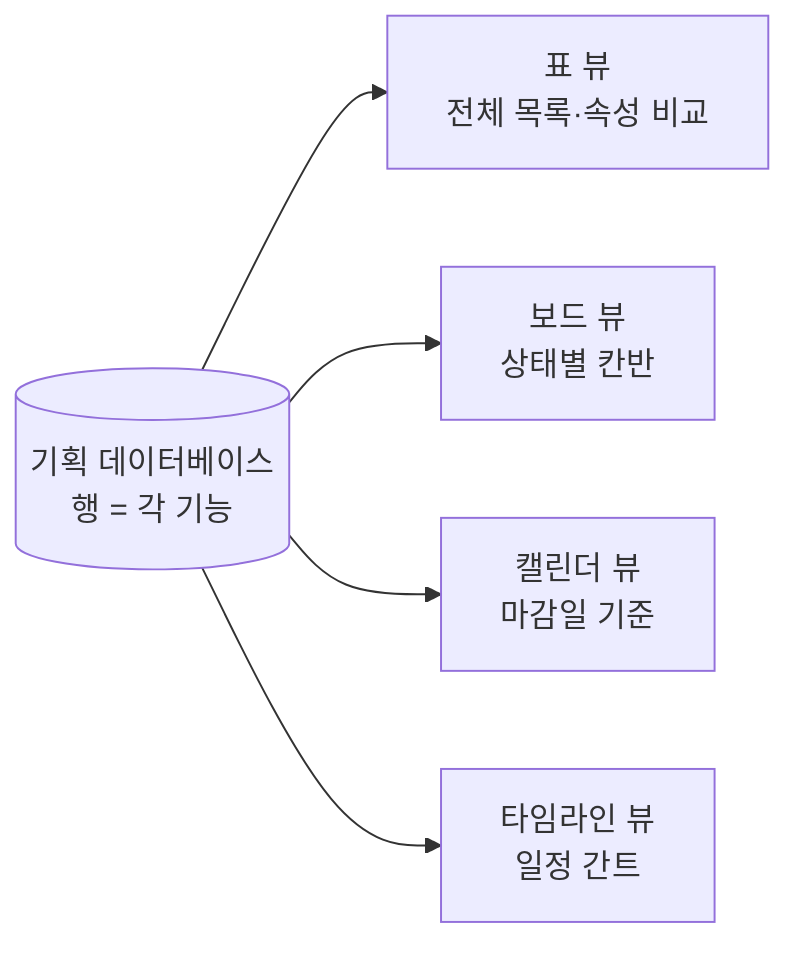
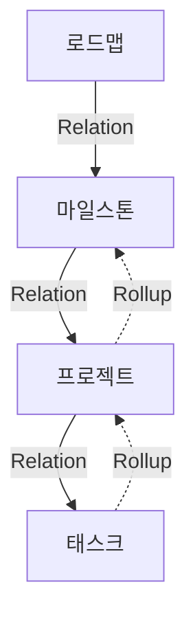
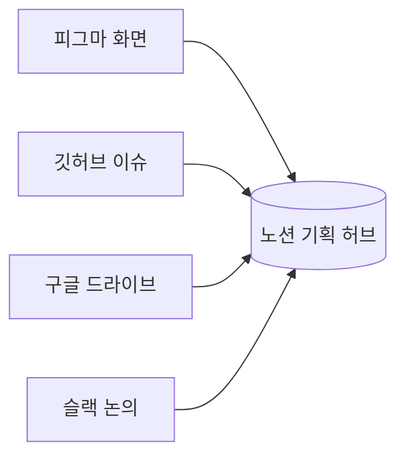

> **한 줄 요약** — 노션은 기획자에게 '메모 앱'이 아니라 *기획이 사는 집*이다. 흩어진 문서·일정·논의가 한곳에 모이고, 그게 데이터베이스로 연결되는 순간 기획서는 죽은 문서가 아니라 살아 움직이는 시스템이 된다.
{: .prompt-tip }

## 기획자의 진짜 적: 흩어짐

기획자가 하루에 만지는 것들을 떠올려 보자. PRD, 화면설계서, 회의록, 일정표, 이슈 목록, 유저 인터뷰 노트, 경쟁사 리서치, 의사결정 기록…

문제는 이것들이 *제각기 다른 곳*에 산다는 거다. PRD는 워드에, 일정은 엑셀에, 논의는 슬랙에, 화면은 피그마에, 할 일은 또 다른 툴에. 며칠만 지나면 "그 결정 어디서 했더라", "최신 버전이 이게 맞나"를 찾는 데 시간을 다 쓴다.

기획자의 생산성을 갉아먹는 건 일의 양이 아니라 이 **흩어짐**이다. 노션이 기획자에게 중요한 이유는 단 하나로 요약된다 — 흩어진 것을 한곳에 모으고, 그걸 *연결*해 주기 때문이다.

> 참고로 노션은 전 세계 1억 명 이상이 쓰고, 포춘 500대 기업의 절반 이상에 도입돼 있다. 기획·제품 직군에서 사실상 표준 도구가 된 데는 이유가 있다.
{: .prompt-info }

## 노션은 '문서'가 아니라 '블록'이다

다른 문서 도구와 노션이 갈리는 첫 지점. 노션의 모든 것은 **블록(block)**이다. 텍스트 한 줄, 이미지 하나, 표 하나가 전부 옮기고 끼우고 떼어낼 수 있는 레고 조각이다.

그래서 한 페이지 안에 글·표·이미지·코드·임베드를 자유롭게 섞을 수 있다. 기획서 중간에 피그마 화면을 박아 넣고, 그 아래 결정 사항을 표로 정리하고, 옆에 회의록을 링크한다 — 이게 한 화면에서 끝난다.

> 기획자에게 — "문서 따로, 표 따로, 그림 따로"의 칸막이가 사라진다. 생각의 흐름대로 한 페이지에 담을 수 있다는 게 노션의 출발점이다.
{: .prompt-info }

## 핵심은 데이터베이스다

여기서부터가 노션을 진짜 기획 도구로 만드는 부분이다. 노션의 표는 평범한 엑셀 표가 아니라 **데이터베이스**다.

차이가 뭐냐. 데이터베이스의 각 행(row)은 그 자체로 *열 수 있는 페이지*다. 'A 기능 기획' 한 줄을 클릭하면 그 안에 상세 PRD가 통째로 들어 있다. 겉으로는 깔끔한 목록, 안으로는 깊은 문서 — 이 이중 구조가 핵심이다.

그리고 각 행에는 **속성(property)**을 붙인다. 상태(진행중/완료), 담당자, 우선순위, 마감일, 직무 같은 값이다.

| 기능명 | 상태 | 담당 | 우선순위 | 마감일 |
| :-- | :-- | :-- | :-- | :-- |
| 온보딩 개편 | 진행중 | 지우 | 높음 | 2026-06-10 |
| 알림 설정 | 대기 | 민기 | 중간 | 2026-06-20 |

속성이 붙는 순간, 같은 데이터를 **여러 모습으로** 볼 수 있게 된다.

## 같은 데이터, 다른 시점 — 뷰(View)

데이터베이스 하나를 만들어 두면, 그걸 표로도 보고 보드로도 보고 캘린더로도 본다. 데이터를 새로 만드는 게 아니라 *같은 데이터를 다른 각도로 비추는* 거다.

- **표** — 모든 기능과 속성을 한눈에 비교할 때.
- **보드(칸반)** — '대기 → 진행중 → 완료'로 진행 상태를 옮겨가며 볼 때.
- **캘린더** — 마감일 기준으로 이번 달 일정을 볼 때.
- **타임라인** — 기능들의 기간이 어떻게 겹치는지 간트 차트로 볼 때.

> 기획자에게 — 개발자에겐 보드를, 디자이너에겐 캘린더를, 리더에겐 타임라인을 보여줄 수 있다. *문서를 세 번 만드는 게 아니라 뷰를 세 개 거는* 것이다. 정보가 하나니 어긋날 일도 없다.
{: .prompt-info }

## 기획서가 '시스템'이 되는 순간 — Relation & Rollup

노션이 단순 메모 앱을 넘어서는 결정적 기능. 데이터베이스끼리 **연결(Relation)**하고, 연결된 값을 **집계(Rollup)**하는 것이다.

엑셀의 VLOOKUP을 떠올리면 되는데, 훨씬 직관적이다. '로드맵 — 마일스톤 — 프로젝트 — 태스크'를 각각의 데이터베이스로 두고 서로 연결하면, 흩어진 목록이 하나의 **유기적인 구조**가 된다.

- **Relation** — "이 프로젝트는 어느 마일스톤에 속하나"를 연결한다.
- **Rollup** — 연결된 태스크의 진행률을 끌어올려 "이 프로젝트는 몇 % 완료"를 자동 계산한다.

태스크 하나를 완료로 바꾸면, 그게 속한 프로젝트의 진척률이 자동으로 올라가고, 마일스톤 달성도에도 반영된다. 기획자가 일일이 진행률을 손으로 고치지 않아도 된다.

> 기획자에게 — 이 연결이 걸리는 순간 기획 문서는 *읽고 끝나는 종이*가 아니라, 현재 상태를 스스로 비추는 *살아 있는 대시보드*가 된다. 이게 노션과 일반 문서 도구의 가장 큰 차이다.
{: .prompt-info }

## 흩어진 도구를 빨아들이는 허브

기획자는 여러 툴 사이를 오간다. 노션은 그 사이를 없앤다. 피그마·깃허브·구글 드라이브·웹페이지를 **임베드(embed)**로 페이지 안에 직접 박아 넣을 수 있다.

기획서를 읽다가 화면을 보려고 피그마로 떠나고, 이슈를 보려고 깃허브로 떠나는 그 *점프*가 사라진다. 한 페이지 안에서 PRD를 읽고, 바로 아래 임베드된 피그마로 화면을 확인한다. 맥락이 끊기지 않는다.

## 합의가 문서 안에서 끝난다

기획의 절반은 커뮤니케이션이다. 노션은 논의를 문서 *바깥*(메신저)이 아니라 문서 *안*에서 끝내게 해 준다.

- **@멘션** — 특정 문장 옆에서 담당자를 호출해 비동기로 논의한다.
- **코멘트** — 화면설계서의 그 버튼, 그 문장에 직접 의견을 단다. "어디 얘기예요?"가 사라진다.
- **권한 설정** — 누구는 편집, 누구는 댓글, 누구는 보기만. 외부 공유 범위도 페이지 단위로 조절한다.
- **버전 기록** — 누가 언제 무엇을 바꿨는지 남는다. "이 결정 누가 했더라"의 답이 문서에 박혀 있다.

> 기획자에게 — 슬랙에서 한 결정은 스크롤과 함께 사라지지만, 문서 안 코멘트로 한 결정은 *그 문장 옆에 영원히 남는다.* 의사결정의 맥락이 보존된다는 건 기획자에게 결정적이다.
{: .prompt-info }

## 빠진 항목 없는 기획서 — 템플릿과 싱크드 블록

매번 PRD를 백지에서 시작하면 항목이 빠진다. 노션은 **템플릿**으로 PRD의 뼈대(배경·목표·요구사항·성공지표·일정)를 고정해 둔다. 새 기획을 시작할 때 버튼 하나면 그 틀이 그대로 깔린다.

**싱크드 블록(synced block)**은 한 발 더 나간다. 한 곳의 내용을 여러 페이지에 동기화해 두면, 원본을 고칠 때 모든 페이지가 같이 바뀐다. 제품 미션이나 핵심 지표처럼 여러 문서에 반복되는 내용을 *한 번만 고치면* 되는 것이다.

> 기획자에게 — "최신 버전이 어디 거지"의 공포가 사라진다. 진실은 한 곳에 있고, 나머지는 그걸 비추기만 한다.
{: .prompt-info }

## 그래도 노션이 만능은 아니다

균형을 위해 한계도 짚자. 노션이 모든 상황의 정답은 아니다.

> - **검색이 약하다.** 데이터베이스의 모든 행이 페이지라서, 정보가 쌓일수록 원하는 문서를 찾기 어려워진다.
> - **진입장벽이 있다.** 자유도가 높은 만큼, 팀원의 숙련도에 따라 활용도가 갈린다. 잘 설계 안 하면 오히려 더 복잡해진다.
> - **대규모 스프린트 관리엔 한계.** 복잡한 이슈 트래킹·스프린트는 지라(Jira) 같은 전용 도구가 더 낫다는 평이 많다. 노션은 '문서+가벼운 관리'에 강하다.
{: .prompt-warning }

핵심은 *무엇에 쓰느냐*다. 기획의 사고와 문서가 사는 집으로는 더없이 좋지만, 수십 명이 도는 본격 애자일 트래킹까지 다 욱여넣으려 하면 무거워진다. 도구의 강점에 맞게 쓰는 게 답이다.

## 정리

> - 기획자의 진짜 적은 일의 양이 아니라 **흩어짐**이다. 노션은 그걸 한곳에 모은다.
> - 노션의 표는 **데이터베이스** — 행이 곧 페이지이고, 속성으로 표·보드·캘린더·타임라인 **여러 뷰**가 된다.
> - **Relation + Rollup**으로 문서끼리 연결·집계되면, 기획서가 *살아 있는 대시보드*가 된다.
> - 임베드·@멘션·코멘트·권한·버전기록으로 **합의와 맥락이 문서 안에 보존**된다.
> - 단, 검색·진입장벽·대규모 스프린트엔 약하다. 강점에 맞게 쓰자.
{: .prompt-tip }

기획자에게 노션이 중요한 이유는 결국 하나다. 기획은 머릿속 생각을 *연결된 형태*로 남기는 일인데, 노션은 그 연결을 그대로 담아내는 그릇이기 때문이다. 흩어진 메모가 아니라, 서로 이어진 하나의 시스템 — 거기서부터 기획의 밀도가 달라진다.

---

## 참고

- 노션으로 PRD 만들기 — [Notion 공식 가이드](https://www.notion.com/help/guides/building-a-product-requirement-document-in-notion)
- 관계형 데이터베이스(Relation·Rollup) — [Notion 도움말](https://www.notion.com/help/relations-and-rollups)
- 제품팀을 위한 위키 만들기 — [Notion 공식 가이드](https://www.notion.com/help/guides/how-to-build-a-wiki-for-your-product-team)
- 노션이 정말 안 맞을 때 — [PM이 생각하는 노션의 단점 (Medium)](https://medium.com/@m.na_88906/project-manage-notion-cb9c87beecc8)
- 노션 사용·성장 통계 — [Notion Statistics 2025 (TapTwice Digital)](https://taptwicedigital.com/stats/notion)
- 함께 보기 — [기획에서 중요한 디자인 용어 정리](/posts/design-terms-for-planners/) · [기획자/운영자로서 알아야 하는 SQL 문법 정리](/posts/sql-for-planners/)
