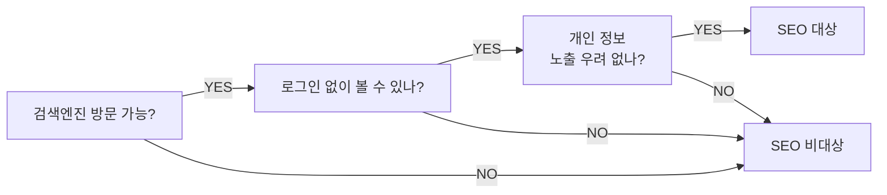

> **한 줄 요약** — 우리 서비스가 출시됐는데 모든 페이지 타이틀이 "Waggle" 하나였다. 페이지마다 어울리는 이름을 붙이는 일은 기획자의 몫이고, 사실 타이틀보다 더 중요한 건 그 아래 메타 설명이다.
{: .prompt-tip }

## "Waggle" 하나로 모든 페이지를 부르고 있었다

와글이 세상에 나온 지 일주일쯤 됐다. 한참 GA로 데이터를 보다가 문득 브라우저 탭을 보니, 모집글을 봐도 "Waggle", 팀 페이지를 봐도 "Waggle", 메시지함을 열어도 "Waggle"이었다. 14개 라우트가 다 같은 이름을 쓰고 있었다.

코드를 까보니 `index.html`에 `<title>Waggle</title>` 한 줄이 박혀 있고, 페이지가 바뀌어도 그 값을 갱신하지 않는 구조였다. React SPA의 흔한 함정이다.

페이지마다 어울리는 이름을 정하는 일은 기획자가 먼저 던져야 하는 문제다. 디자이너도 개발자도 아니다.

## 페이지 타이틀이 보이는 곳, 세 군데

타이틀이 어디에 쓰이는지부터 정리하면 왜 신경 써야 하는지가 명확해진다.

1. **브라우저 탭** — 여러 탭을 켜뒀을 때 어떤 페이지인지 식별하는 한 줄.
2. **구글·네이버 검색 결과** — 파란색 큰 글씨가 그 타이틀이다. 클릭 여부가 여기서 갈린다.
3. **카카오톡·SNS 공유 미리보기** — 친구에게 링크 보냈을 때 뜨는 카드 제목.

세 곳 모두 짧고 정보가 있고 브랜드가 보이는 형태여야 한다. 50~60자가 권장 길이고 그 이상은 잘려서 보인다.

## 우리가 정한 규칙: `Waggle 와글 | 내용`

와글 사이트맵을 펴놓고 14개 페이지에 이름을 붙이며 규칙을 하나 정했다.

> **규칙**: `Waggle 와글 | 페이지 내용`
{: .prompt-tip }

- **브랜드 먼저** — 탭이 좁아져 잘려도 "Waggle 와글"은 항상 보인다.
- **영문·한글 병기** — 영문 검색 사용자와 한글 검색 사용자를 둘 다 잡는다.
- **버티컬 바(`|`) 구분자** — 가독성이 좋고 SEO 가이드들이 거의 다 권장한다.

적용 예시.

```
Waggle 와글 | 사이드 프로젝트 팀원 찾기          (메인)
Waggle 와글 | 새 모집글 작성                    (작성 폼)
Waggle 와글 | {모집글 제목}                     (모집글 상세, 동적)
Waggle 와글 | {팀 이름} 모집글 관리             (팀 관리)
Waggle 와글 | 페이지를 찾을 수 없어요            (404)
```

같은 형식을 14개에 반복하니, 사용자가 "와글의 어떤 페이지에 있구나"가 한눈에 잡힌다.

## 사실은 메타 설명이 더 중요하다

타이틀을 다 정하고 나니 다음 관문이 있었다. 검색 결과에서 타이틀 아래 회색 글씨로 두세 줄 나오는 그 문장 — **메타 설명(meta description)**.

구글이 공식적으로 "메타 설명은 직접적인 랭킹 요인이 아니다"라고 말한다. 그런데 클릭율(CTR)에는 큰 영향을 준다. 같은 검색 결과 자리에 있어도, 설명이 매력적이면 사람들이 클릭하고 무미건조하면 지나간다.

> 검색 노출에서 *순위*는 타이틀이 결정하지만, *클릭*은 메타 설명이 결정한다.
{: .prompt-info }

권장 길이는 80~160자. 너무 짧으면 정보가 부족하고, 너무 길면 잘려서 "..."로 끝난다. 안에 담아야 하는 건 그 페이지에서 사용자가 얻을 수 있는 것 — 행동을 유도하는 동사가 있으면 더 좋다.

와글 메인 페이지의 메타 설명은 이렇게 잡았다.

> 사이드 프로젝트·창업·스터디 팀원을 가장 쉽게 찾는 곳. 직무와 스킬로 매칭하고, 모집글을 올리고, 바로 지원하세요. 개발자·디자이너·기획자 팀빌딩은 와글에서.

키워드(사이드 프로젝트, 팀원, 매칭, 직무, 스킬)를 자연스럽게 흩고, 행동(찾고, 올리고, 지원하세요)을 명시했다.

## 모든 페이지를 SEO 대상으로 둘 필요는 없다

처음엔 14개 페이지 모두 메타 설명을 채울 생각이었다. 그런데 와글의 라우트를 다시 보니 검색엔진이 들어올 수 있는 페이지가 따로 있었다.



와글의 14개 라우트 중 로그인 없이 누구나 들어올 수 있고 개인 정보 노출 우려가 없는 페이지는 **3개**였다.

- `/` — 메인 (모집 피드)
- `/post/:postId` — 모집글 상세
- `/team/:teamId` — 팀 홈

나머지(작성 폼, 팀 관리, 메시지 등)는 로그인이 필요한 사적 페이지다. 검색엔진은 로그인을 못 하니 거기까진 못 들어온다. 프로필 페이지(`/profile/:userId`)도 기술적으론 오픈이지만, 사용자 이름·이력이 노출되는 페이지라 SEO 대상에서 제외하기로 했다. 검색 결과에 사용자 정보가 무방비로 노출되는 건 운영자 입장에서도 부담이다.

> 모든 페이지에 SEO 작업을 하는 건 무의미하고, 때로는 해롭다. 사적인 페이지에 메타 설명을 채워 검색엔진에 노출되게 만들면 사용자가 의도하지 않은 정보가 퍼진다.
{: .prompt-warning }

결국 메타 설명을 꼼꼼히 다듬을 페이지는 3개로 좁혔다. 나머지 11개는 타이틀만 깔끔하게 정리하고, 메타 설명은 비워두거나(또는 일반 안내문으로 채우거나) `robots: noindex`를 걸어 검색엔진이 색인하지 않게 만든다.

## 정리

> - 페이지 타이틀은 **브라우저 탭·검색 결과·SNS 미리보기** 세 군데에 다 쓰인다.
> - 형식 통일이 중요하다. 와글은 `Waggle 와글 | 내용`으로 정했다.
> - 순위는 타이틀, 클릭은 메타 설명. 메타 설명이 사실 더 중요하다.
> - 권장 길이: 타이틀 50~60자, 메타 설명 80~160자.
> - 모든 페이지가 SEO 대상은 아니다. 오픈 페이지만, 그것도 공개해도 괜찮은 페이지만 골라서.
{: .prompt-tip }

페이지에 이름을 붙이는 건 작은 일처럼 보이지만, 사용자가 우리 서비스를 처음 만나는 그 한 줄이다. 검색 결과에서, 카톡으로 받은 링크 카드에서, 북마크 목록에서. 그 한 줄을 정하는 일은 기획자의 책상에서 시작되는 게 자연스럽다.

---

## 참고

- title 가이드 — [Google 검색 센터: title 링크](https://developers.google.com/search/docs/appearance/title-link)
- meta description 가이드 — [Google 검색 센터: meta description 사용 방법](https://developers.google.com/search/docs/appearance/snippet)
- robots noindex — [Google 검색 센터: robots meta tag](https://developers.google.com/search/docs/crawling-indexing/robots-meta-tag)
- SEO 기초 — [Moz: Beginner's Guide to SEO](https://moz.com/beginners-guide-to-seo)
- 함께 보기 — [런칭 일주일, GA가 가르쳐준 것](/posts/week-one-with-ga/) · [기획자에게 노션이 중요한 이유](/posts/why-notion-matters-for-planners/)
