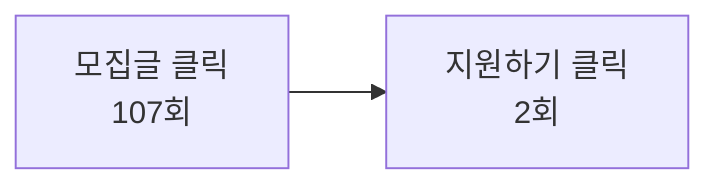

> **한 줄 요약** — 와글 런칭하고 한 일주일, 매일 GA를 켰다. 숫자가 가르쳐준 건 "다음에 뭘 만들지"였고, 무엇보다 모바일이 데스크톱보다 많다는 사실이었다. 반응형 디자인은 더는 미룰 수 있는 일이 아니었다.
{: .prompt-tip }

## 런칭하고 매일 GA를 켰다

와글이 세상에 나온 지 일주일. 출시 전엔 "사람들이 와줄까"가 가장 큰 걱정이었는데, 막상 열고 나니 다른 걱정이 시작됐다. 와준 사람들이 *어디서 멈추는지*, *뭘 더 보고 싶어 하는지*가 안 보이는 게 답답했다.

그래서 GA를 켰다. 매일 아침 활성 사용자랑 페이지뷰부터 봤고, 점점 더 깊은 화면들을 들여다보게 됐다. 결과만 말하면, 일주일치 숫자가 다음 한 달의 우선순위를 거의 다 정해줬다.

## 1. 모바일이 더 많았다

가장 의외의 한 줄. **모바일 30명, 데스크톱 25명.** 비슷하긴 한데 모바일이 살짝 더 많았다.

기획할 때 머릿속엔 데스크톱 화면이 먼저 떠올랐다. 와이어프레임도, 화면설계서도, 첫 디자인 시안도 다 데스크톱이었다. 그런데 정작 와서 써본 사람은 지하철에서 휴대폰으로 본 사람이 더 많았던 거다.

> 기획자에게 — "반응형은 다음 스프린트에서"라고 미뤘던 항목들이 이제 1순위가 됐다. 데이터가 우선순위를 알아서 바꿔준다.
{: .prompt-info }

## 2. 모집글이 거의 전부였다

페이지뷰 top 10을 줄여보면 이렇다.

| 순위 | 페이지 | 조회수 |
| :-- | :-- | :-- |
| 1 | `/` (메인) | 683 |
| 2 | `/post/1` | 96 |
| 3 | `/team/1` | 64 |
| 4 | `/team/3` | 54 |
| 5 | `/post/2` | 50 |
| 6~10 | `/profile/…`, `/post/3~5`, `/post/new` | 20~24 |

메인 다음으로는 거의 다 모집글 상세 페이지였다. 사람들은 메인에서 모집글을 골라 들어간다. 그게 와글에서 일어나는 가장 큰 행동이었다.

다음에 만들 화면도 명확해졌다. 모집글이라는 콘텐츠를 어떻게 더 잘 보여줄지. 카드 디자인, 미리보기, 정렬, 추천. 여기에 시간을 더 써야 한다.

## 3. 클릭은 많은데 지원은 거의 없었다

가장 충격적인 숫자.

모집글을 누른 건 107번, 지원 버튼은 2번. 거의 50:1이다. 들어와서 본 건 많은데 행동으로 안 이어졌다.

원인 후보는 많다. 지원 버튼이 안 보이거나, 비로그인 상태에서 막히거나, 모집글 본문이 충분히 설득력이 없거나, 지원 폼이 너무 길거나.

> 기획자에게 — 어디가 새는지는 봤는데, *왜* 새는지는 GA가 안 알려준다. 다음 한 주는 인터뷰랑 세션 리플레이로 *왜*를 찾으러 가야 한다.
{: .prompt-info }

## 4. 검색이랑 필터는 거의 안 썼다

- 검색 이벤트: 2번
- 직무 필터: 3번
- 스킬 필터: 4번

이거 보고 좀 머쓱했다. 모집글이 쌓이면 사람들이 검색·필터로 원하는 팀을 찾을 거라고 가정했는데, 그렇게 쓰는 사람이 거의 없었다. 검색창이 눈에 안 들어오거나, 메인 카드 스크롤이 더 편하거나.

다음 단계는 디스커버리 재설계다. 검색을 더 보이게 하든, 필터를 한 단계 위로 끌어올리든, 추천 카드 자체를 똑똑하게 만들든.

## 5. 그래도, 5분 51초를 머물렀다

평균 세션 시간 **351초.** 한 번 들어오면 거의 6분을 본다. 적은 트래픽이지만 얕은 트래픽은 아니다. 들어온 사람은 진짜로 모집글을 읽고 있다.

이 숫자가 의외로 위로가 됐다. 지원 버튼은 안 눌려도, 와글이라는 공간 자체가 잠깐 보고 나가는 곳은 아니라는 뜻이니까.

## 정리 — 다음 한 달의 방향

> - **반응형 디자인**을 1순위로 올린다. 모바일 사용자가 이미 절반을 넘었다.
> - **모집글 카드·상세**를 더 잘 보여주는 데 시간을 쓴다. 사람들이 여기 가장 많이 머문다.
> - **클릭 → 지원 전환**의 새는 곳을 찾아 막는다. 인터뷰랑 세션 리플레이로 *왜*를 본다.
> - **디스커버리**(검색·필터) 위치와 모양을 다시 본다. 안 쓰이면 없는 거나 마찬가지다.
{: .prompt-tip }

기획자가 데이터를 본다는 건 예측을 검증하는 일이다. 일주일치 GA는 내 예측의 절반쯤을 부드럽게 뒤집어 놨다. 모바일을 가볍게 본 것, 검색을 과대평가한 것, 지원까지의 길이 매끄럽다고 믿은 것.

다음 일주일은 이 네 가지를 들고 다시 화면을 그릴 차례다. 데이터가 알려주는 방향대로.

---

## 참고

- 함께 보기 — [기획자/운영자로서 알아야 하는 SQL 문법 정리](/posts/sql-for-planners/) · [기획자에게 노션이 중요한 이유](/posts/why-notion-matters-for-planners/) · [와글 런칭 축하](/posts/celebrating-waggle-launch/)
